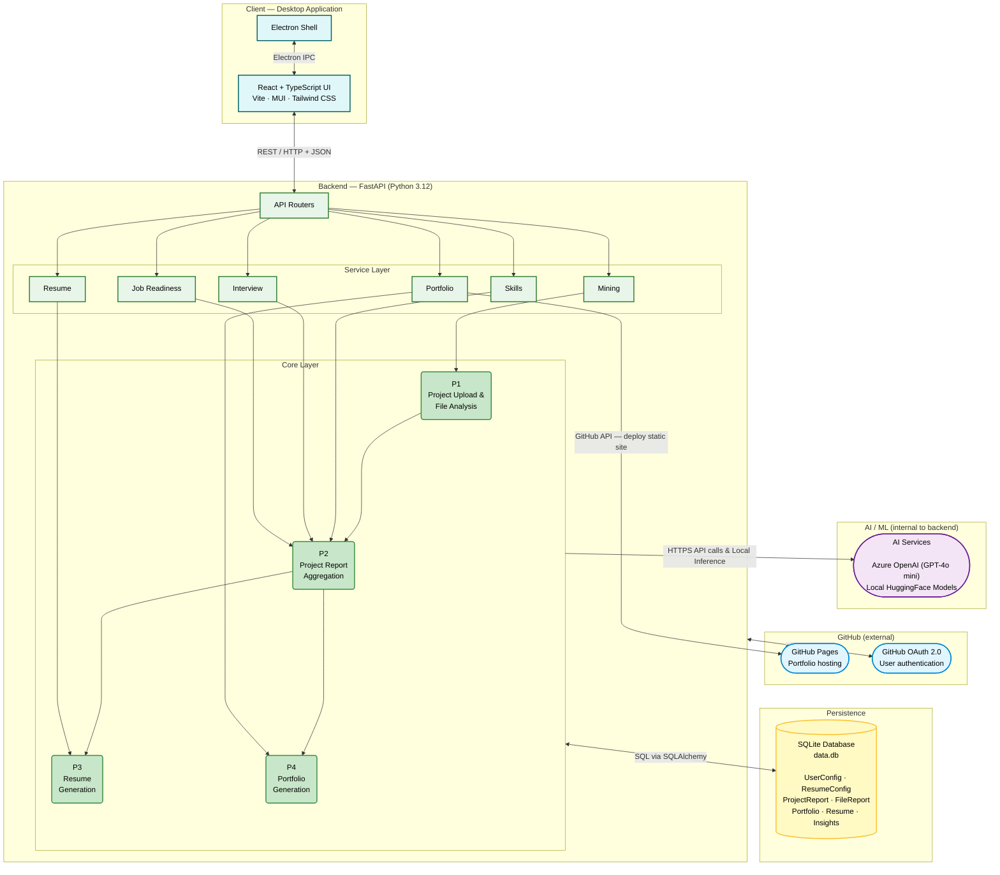
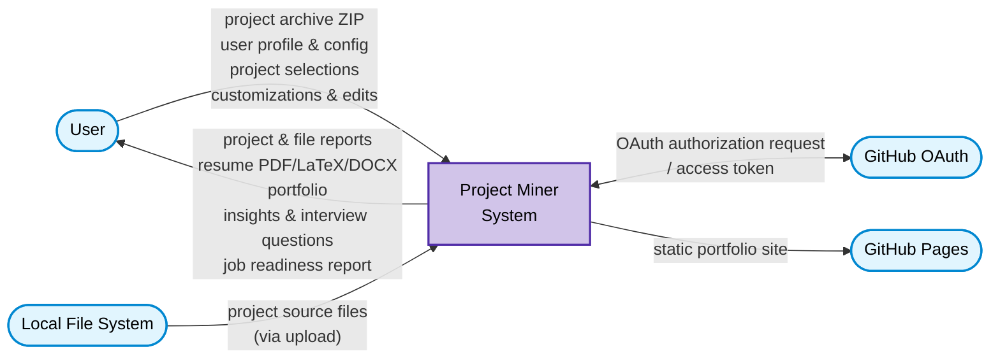
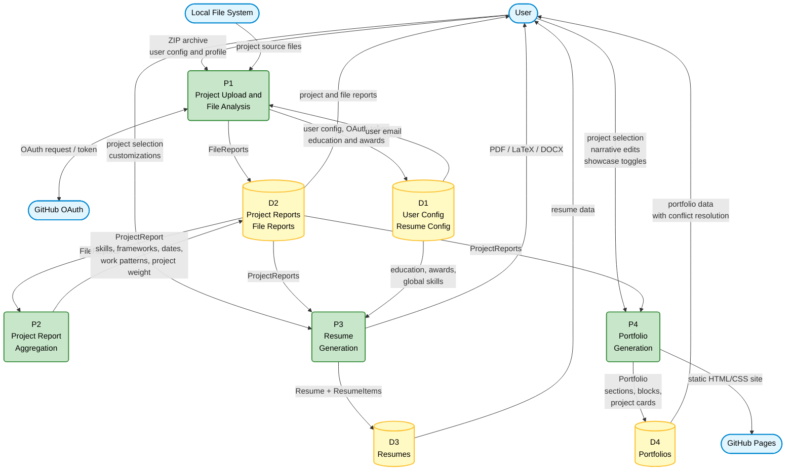

# COSC 499: Capstone Software Engineering Project, Team 18

Team 18's project miner. This README has been updated with Milestone 2 requirements. This guide will walk you through the set up.

## Contents
1. **[Setup and Installation Guide](#setup-and-installation-guide)**
2. **[How to Use the System](#how-to-use-the-system)**
3. **[Known Bugs](#known-bugs)**
4. **[Testing the System](#testing-the-system)**
5. **[Milestone 3 Documentation](#milestone-3-documentation)**
6. **[Milestone 2 Documentation](#milestone-2-documentation)**
7. **[Milestone 1 Documentation](#milestone-1-documentation)**

## Setup and Installation Guide

Our project is a desktop application that uses Electron for the frontend, the Python and the FastAPI web framework for the backend, and a MySQL database for storing user data. The entire app exists on the user's local device and is hosted over their local network.

### Supported Operating Systems:
- macOS
- Linux
- Windows (WSL recommended)

### Prerequisites

- **[Dev Containers](https://marketplace.visualstudio.com/items?itemName=ms-vscode-remote.remote-containers)** extension for VSCode
- **[Docker](https://www.docker.com/products/docker-desktop/)** (v4.65.0 or higher)
- **[npm](https://docs.npmjs.com/downloading-and-installing-node-js-and-npm)** (v11.6.1 or higher)
- **[Node.js](https://docs.npmjs.com/downloading-and-installing-node-js-and-npm)** (v20.0.0+ required; enforced via `ui/package.json` engines field)

### Downloading the Project and Starting the Backend

#### Steps:
1. Clone this repository locally, and open the folder in VSCode.

2. Accept the prompt to create a Dev Container. If there is no prompt, do the following:
  - Open the Command Palette by pressing `Ctrl+Shift+P` (Windows/Linux) or `Cmd+Shift+P` (macOS).
  - Enter `>Dev Containers: Open Folder in Container...`. Docker will build the container and install all necessary dependencies within it.

3. Once the project has opened in the dev container, download the **499-Files** folder [here](https://ubcca-my.sharepoint.com/:f:/r/personal/ataschuk_student_ubc_ca/Documents/499-Files?csf=1&web=1&e=vlLZVP). You will need to log in to Microsoft with your UBC CWL account.

The folder contains the following files:
- `.env`: Contains sensitive information for our project. After this file has downloaded, move it into the project's root directory.
- `directed-study-thumbnail.png`: An image file that can be used as a thumbnail for the **cosc-448-directed-study** project.
- `info.txt`: Contains the GitHub username and email address to enter on the profile page.
- `literary-quote-thumbnail.bmp`: An image file that can be used as a thumbnail for the **Literary-Quote-Clock** project.
- `projects.zip`: Contains the projects our app will analyze.
- `selectify-thumbnail.png`: An image file that can be used as a thumbnail for the **Selectify** project.


4. Open a new terminal in the dev container and do the following:

    ```bash
    source .env
    ```

    Then, start the API with:
    ```bash
    cd miner && fastapi dev ./src/interface/api/api.py
    ```

    When it API is ready to receive requests, it will print the following to the terminal:
    ```bash
    INFO   Application startup complete.
    ```

**Note:** If you get a `sqlalchemy.exc.OperationalError`, it is likely because you are not CD'd into `/miner`.

You can verify the API is running by going to http://127.0.0.1:8000/ping in your browser. You should see "pong".

### Starting the Frontend

#### Steps:
1. **Outside of the dev container** open a new terminal instance and cd into the `ui/` folder of the project with:
    ```bash
    cd your/path/to/capstone-project-team-18/ui
    ```

2. Download and install the UI's dependencies:
    ```bash
    npm install
    ```

3. Start the Electron app:
    ```bash
    npm run dev
    ```

For help with error handling, check [`ui/troubleshoot.md`](/ui/troubleshoot.md).

## How to Use the System

This is a YouTube video covering how to download and set up our project.

[](https://youtu.be/VPYGA6Qi-Ws "UBCO COSC 499 Team 18 Project Setup")

## Known Bugs

## Testing the System

### Backend Testing

We use the [`pytest`](https://docs.pytest.org/en/stable/) framework to test our backend logic and ensure that the system will perform as expected. All backend tests are located at `/miner/tests/`. The testing suite includes fixtures for a temporary database, test projects, test `FileReports`, `ProjetReports`, etc., and more.


To test the backend, open the project in a dev container. Open a new terminal instance, cd into the `/miner` directory, and run:
```bash
pytest
```

By default, tests for machine learning (ML) are skipped for local testing because they take significantly longer than the others (> 5 minutes). You can explicitly include them by running:
```bash
RUN_ML_TESTS=1 pytest
```

- _Note_: We have a continuous integration pipeline configured for all pull requests (PRs) that requires all backend and frontend tests to pass before a PR can be merged.
This pipeline _does_ run the ML tests by default.


### Frontend Testing

The Electron UI uses [`Vitest`](https://vitest.dev/) to run unit tests for the frontend. The API is not required to be running for these tests to work.

#### What we Test
- API client behavior (URL construction, base URL normalization).
- Correct endpoint calls (`/projects`, `/projects/{project_name}`, `/skills`, `/ping`).
- URL encoding for route parameters (e.g., project names with spaces such as "My Project").
- Error handling for non-200 HTTP responses, including actionable error messages.
- Backend connectivity checks independent of database state

#### How the Tests Work
In order to keep UI tests fast, deterministic, and independent from the backend:
- Tests are run in a Node/Vitest environment, not in a browser.
- `fetch` is mocked using Vitest (`vi.fn()`), so no real HTTP requests are made.
- Environment variables (e.g., `VITE_API_BASE_URL`) are injected manually per test.

### Running the UI Tests Locally

To test the UI, open a terminal instance outside of the dev container, cd to the `/ui` directory, and run:

```bash
npx vitest run
```

**Vitest Output**


## Milestone 3 Documentation

**Note:** The API documentation in [**Milestone 2 Documentation**](#milestone-2-documentation) is outdated as of Milestone 3. Please refer to [api_endpoints.md](/documentation/api_endpoints.md) for up-to-date documentation on our API.

### Diagrams

## 1. System Architecture

Shows the full deployment topology: the desktop application layers, backend layers, persistence, AI/ML services, and external GitHub services.



---

## 2. DFD Level 0 — Context Diagram

Shows the system as a single process with all external entities and top-level data flows across the system boundary.



---

## 3. DFD Level 1 — System Processes

Decomposes the system into 4 core processes, 4 data stores, and the same external entities from Level 0.

**External Entities:** User / GitHub OAuth / GitHub Pages / Local File System
**Data Stores:** D1 User Config/Resume Config / D2 Project Reports/File Reports / D3 Resumes / D4 Portfolios



### Milestone Requirements

We have met all milestone requirements. Additionally, we have a bonus deployment feature.

1. A One-Page Résumé:
- Education/Awards
- Skills, categorized by expertise level
- Projects, highlighting evidence of contributions/impact

**The Résumé Edit Page**


**Exported PDF Résumé**


2. A Web Portfolio:
- Timeline of skills, demonstrating learning progression and increased in expertise/depth
- Heatmap of project activities, showing evidence of productivity over time
- Showcase of top 3 projects, illustrating process to demonstrate evolution of changes
- Dashboard supports a private mode where the user can interactively customize specific components or visualizations before going live
- Dashboard supports a public mode where the dashboard information only changes based on search and filter


**The Portfolio Edit Page**


**Portfolio Deployed to a GitHub Pages Site**


## Milestone 2 Documentation

### API Endpoints

While the backend is running, all endpoints can be explored interactively via Swagger at http://127.0.0.1:8000/docs. The documentation has also been added here for your convenience.

**NOTE:** As of [Milestone #3](#milestone-3-documentation), this documentation is out of date. Please refer to [api_endpoints.md](/documentation/api_endpoints.md) for up-to-date documentation on our API.

---

#### `POST /privacy-consent`

Sets the user's privacy consent and profile information. This must be completed before uploading projects.

**Request body:**
```json
{
  "consent": true,
  "user_email": "user@example.com",
  "github": "myusername"
}
```

**Response:**
```json
{
  "message": "Consent granted",
  "consent": true,
  "user_email": "user@example.com",
  "github": "myusername"
}
```

---

#### `POST /projects/upload`

Uploads a zipped project file for analysis. The miner will extract the zip, discover projects inside, analyze each file for skills, languages, and commit patterns, then save the results to the database.

**Supported formats:** `.zip`, `.7z`, `.tar.gz`, `.gz`

**Query parameters:**
- `email` (optional) — associates an email with the upload
- `portfolio_name` (optional) — overrides the name derived from the filename

**Request body:** `multipart/form-data` with a `file` field.

**Response:**
```json
{
  "message": "Project uploaded and analyzed successfully",
  "portfolio_name": "MyProject"
}
```

---

#### `GET /projects`

Returns a list of all analyzed projects stored in the database.

**Response:**
```json
{
  "projects": []
}
```

---

#### `GET /projects/{project_name}`

Retrieves the full analysis report for a specific project by name.

**Response:**
```json
{
  "project_name": "MyProject",
  "user_config_used": 1,
  "image_data": null,
  "created_at": "2026-02-25T10:00:00",
  "last_updated": "2026-02-25T10:00:00"
}
```

---

#### `GET /projects/{project_name}/showcase`

Returns a project formatted for showcase display — including dates, frameworks, and bullet points derived from the project analysis.

**Response:**
```json
{
  "project_name": "MyProject",
  "start_date": "2025-01-01T00:00:00",
  "end_date": "2025-06-01T00:00:00",
  "frameworks": ["Python", "FastAPI"],
  "bullet_points": ["Implemented REST API", "Designed database schema"]
}
```

---

#### `GET /skills`

Returns all skills extracted across all analyzed projects, weighted by how prominently they appear.

**Response:**
```json
{
  "skills": [
    { "name": "Machine Learning", "weight": 3.96 },
    { "name": "Database", "weight": 2.4 }
  ]
}
```

---

#### `GET /user-config`

Returns the current user configuration including consent status, email, and GitHub username.

**Response:**
```json
{
  "id": 1,
  "consent": true,
  "user_email": "user@example.com",
  "github": "myusername"
}
```

---

#### `PUT /user-config`

Updates the user configuration.

**Request body:** Full `UserConfig` object.

---

#### `GET /github/login`

Called by the frontend to generate an OAuth state. Generates and returns a
GitHub authorization URL. The frontend should open the URL with the OS browser
to get the user's auth code (which will be used to get the access token).

**Response:**
```json
{
  "state": state,
  "authorization_url": authorization_url,
  "callback_scheme": ELECTRON_CALLBACK_SCHEME,
}
```

**Raises:**
- 500: `GITHUB_CLIENT_ID` and/or `GITHUB_REDIRECT_URI` missing from `.env`.

---

#### `GET github/oauth-status`

Called by the frontend every 2 sec to poll the backend OAuth status for a generated state. This is a fallback if the deep link fails so that the frontend still knowns what the result (user accepts or denies) is so that it can switch from "pending" to "Connected".

Response:
```json
{
  "state": state,
  "status": oauth_state.get("status"),
  "detail": oauth_state.get("detail"),
}
```

---

#### `GET github/callback`

 Called by GitHub when the user does (or doesn't) authenticate our app. This gives us the auth code, which we use to get the access token (needed to take action on the user's behalf). A short piece of HTML to prompt the user to reopen our Electron app is returned in response.
- e.g., http://localhost:8000/api/github/callback?code=abcdef123456

**Request body:**
```json
{
  "state": state,
  "code": code,
  "error": error,
}
```

**Returns:**  An HTML popup in the browswer prompting the user to return to the Electron app.

**Raises:**
- Error: Thrown when the user denies access or some generalized error occurs.
- Code Error: Missing authorization code.
- No user configuration has been created yet (equivalent to `USER_CONFIG_NOT_FOUND`).
- HTTP Error: Error generating HTML page for popup to return to Electron.

---

#### `PUT github/revoke_access_token`

Sets the `access_token` column in the `UserConfigModel` to `None`.

**Returns:**
```json
{
  "message": "Access token revoked"
}
```

**Raises:**
- 404 `USER_CONFIG_NOT_FOUND`: No user configuration has been created yet.
- 500 `DATABASE_OPERATION_FAILED`: Failed to set user's access token to `None`.

***Note*:** This endpoint should be called in conjunction with frontend logic to send the user to https://github.com/settings/applications so that they can revoke access on their end too.


#### `POST /resume/generate`

Generates a resume from a list of previously analyzed projects.

**Request body:**
```json
{
  "project_names": ["ProjectA", "ProjectB"],
  "user_config_id": 1
}
```

**Response:** Full resume object with items, skills, email, and GitHub.

---

#### `GET /resume/{resume_id}`

Retrieves a previously generated resume by ID.

---

#### `POST /resume/{resume_id}/edit/metadata`

Updates the email and GitHub username on an existing resume.

**Request body:**
```json
{
  "email": "new@example.com",
  "github_username": "newusername"
}
```

---

#### `POST /resume/{resume_id}/edit/bullet_point`

Edits or appends a bullet point on a specific resume item.

**Request body:**
```json
{
  "resume_id": 1,
  "item_index": 0,
  "new_content": "Built a REST API with FastAPI",
  "append": true,
  "bullet_point_index": null
}
```

---

#### `POST /resume/{resume_id}/edit/resume_item`

Edits the metadata (title, start date, end date) of a specific resume item.

---

#### `POST /resume/{resume_id}/refresh`

Re-runs the resume generation pipeline using the same projects, producing an updated resume with the latest analysis data.

---

#### `GET /portfolio/{portfolio_id}`

Retrieves a generated portfolio by ID.

---

#### `POST /portfolio/generate`

Generates a portfolio from a list of previously analyzed projects.

**Request body:**
```json
{
  "project_names": ["ProjectA", "ProjectB"],
  "portfolio_title": "My Portfolio"
}
```

---

#### `POST /portfolio/{portfolio_id}/refresh`

Re-runs portfolio generation for an existing portfolio using the same projects.

---

#### `POST /portfolio/{portfolio_id}/sections/{section_id}/block/{block_tag}/edit`

Edits a specific block within a portfolio section.

---

#### `GET /portfolio/{portfolio_id}/conflicts`

Returns all blocks currently in a conflict state, for the UI to highlight edits that differ from the system-generated version.

---

#### `POST /portfolio/{portfolio_id}/sections/{section_id}/blocks/{block_tag}/resolve-accept`

Resolves a conflict by accepting the system-generated version of a block.

### Milestone 2 Requirements

The full list of Milestone 2 requirements has been completed

#### R21

**Allow incremental information by adding another zipped folder of files for the same portfolio or résumé that incorporates additional information at a later point in time**

To showcase this, if you upload the early project and create a resume and portfolio, upload the later project, then call the portfolio and resume refresh endpoints, you will see the updated changes.

#### R22

**Recognize duplicate files and maintains only one in the system**

Duplicate files are recongnized by file path, and only one file (or internally called FileReports) are maintained.

#### R23

**Allow users to choose which information is represented (e.g., re-ranking of projects, corrections to chronology, attributes for project comparison, skills to highlight, projects selected for showcase)**

This use case can be achieved through editing the portfolio or resume.

#### R24

**Incorporate a key role of the user in a given project**

A user will be given roles in a project based on their commit habits. For example, an output may be "The user is a Contributor who demonstrates a bursty work pattern, primarily focusing on documentation and feature development, with a significant number of commits in a short time frame."

#### R25

**Incorporate evidence of success (e.g., metrics, feedback, evaluation) for a given project**

Evidence of success is included in project summaries by naming the specific features each project has. For example, an output may be "EarthLingo aims to enhance phonics education through pronunciation feedback and speech recognition using a tech stack that includes React, Next.js, TypeScript, and Speech Recognition." or "The TouristHelperApp aims to facilitate event management and trip planning by enabling users to add events, search for events, create trips, and generate itineraries. "

#### R26

**Allow user to associate a portfolio image for a given project to use as the thumbnail**

#### R27

**Customize and save information about a portfolio showcase project**

The endpoint `/projects/{project_name}/showcase/customization` allows users to edit and save information about their portoflio showcase project.

#### R28

**Customize and save the wording of a project used for a résumé item**

The endpoint `POST /resume/{resume_id}/edit/bullet_point` can be used to edit the wording of a resume project.

#### R29

**Display textual information about a project as a portfolio showcase**

The textual information portfolio showcase item can be retrieve with the endpoint ``. Users will select their portoflio showcase, and that information will be displayed

#### R30

**Display textual information about a project as a résumé item**

Here is an example of a resume item. It contains textual information:
```
COSC310Group : January, 2025 - April, 2025
Frameworks: tkinter, pytest, typing
   - Project was coded using the Python language
   - Utilized skills: CI/CD, Web Development, Testing
   - Collaborated in a team of 7 contributors
   - Authored 59.16% of commits
   - Accounted for 63.5% of total contribution in the final deliverable
   - During the project, I split my contributions between following acitivity types: 66% on code, 34% on test
   - The user is a key contributor to the project, focusing primarily on bug fixes and feature enhancements, with a strong emphasis on refactoring and maintaining documentation.
   - Work pattern: bursty
   - Primary contribution focus: fix (35%); Secondary: feat (25%)
```

#### R31

**Use a FastAPI to faciliate the communication between the backend and the frontend**

Achieved. We use FastAPI for our API needs.

#### R33/R34

Google Drive Link to the Zipped Folder: https://drive.google.com/file/d/1M0gzxZIEF1atHYQo4MammYUo7qcb4Fpz/view?usp=sharing

#### R35

**Your API endpoints must be tested as if they are being called over HTTP but without running a real server, ensuring the correct status code and expected data.**

Endpoints are tested over HTTP.

#### R36

**Your system must have clear documentation for all of the API endpoints**

See this README, the Swagger docs, and the code docstring.


# Milestone 1 Documentation

## Team Contract [ [pdf](./documentation/milestone-1/contract.pdf) ]

**Team 18**: Jimi Ademola, Priyansh Mathur, Tawana Ndlovu, Erem Ozdemir, Sam Sikora, Alex Taschuk

### Our Team's Vision and Goals

Going into this project, we wanted to make something that everyone in the team would be able to appreciate by the end of the year. We understood that to complete the app, we would need to work as a team that supported each other and communicated frequently. This meant leaving helpful comments on code reviews, ensuring that everyone knew what was expected of each other, and taking on as even a workload as possible.

### Expectations

#### Meetings

We all meet in person once a week to discuss our current individual in-progress tasks, what our personal goals and teams' goals are for the upcoming week(s), issues that are currently open, issues that may need to be created, and to brainstorm new features and ways that we can improve our app. During in-person meetings, we make sure that everyone is given equal opportunity to talk and/or ask any questions that they may have.

Everyone is expected to know ahead of time what they are currently working on, and, if they have any tasks for the upcoming week(s), what those tasks are. If someone needs guidance on what their next task should be, we talk as a team to figure out what they can do.

During these meetings, we will often use a whiteboard to take notes/visualize ideas, but one person in the team will take notes during the meeting if necessary.

#### Communication and Collaboration

##### Frequency of Communication

Everyone is expected to be regularly active in the group chat and participate in conversations about the project.

##### Communication Behavior

As a team, we give everyone equal opportunity to speak during in-person meetings. In-person and online, we treat each other with respect and provide constructive feedback, comments, and criticism when necessary. When we receive feedback on our work, we give genuine consideration to what our teammate has said.

##### Channels for Discussions

In addition to weekly in-person meetings, we frequently communicate in a group chat to discuss day-to-day items, let teammates know when they've been assigned a pull request (PR), and get input from each other on bug fixes and features in the process of being implemented.

##### Collaboration Process

Each member of the team is expected to put an equal amount of effort and work towards the project. We understand that individual workload outside of this course may vary from person to person throughout the semester, and that the complexity of tasks for the project will vary. Given this, it is expected that on a semester-long timeline, each member is contributing a "fair" amount to the project (i.e., they are not assigning themselves only easy tasks, or on the contrary, assigning themselves too many tasks, leaving very little for the others).

If at any point during the semester is there be a period of time (1-2 weeks) where a member is overloaded with work and will not have the bandwidth to contribute as much as the others, they should communicate this with the other members to ensure that the team's workload allocation takes this into consideration so as to minimize the amount of progress that is slowed down during that time.

PRs are expected to be thorough but concise. Before any PR is merged to a parent branch, two teammates are assigned to review the code and leave thoughts, comments, suggestions, etc., which may require the PR's author to fix some code in the PR. If this requires a larger team discussion, it should be set aside for the next in-person meeting, if necessary.

When a teammate is assigned to review a PR, it is expected that they will make an effort to properly review the code and thoroughly review it for any holes in the logic, bugs, etc.

Everyone is expected to review a similar number of PRs, and PR authors are expected to assign team members to their PRs evenly.

#### Distribution and Delivery of Work

##### Defining Project Tasks

Project tasks are defined in the GitHub [Issues](https://github.com/COSC-499-W2025/capstone-project-team-18/issues) tab of our repository. When an issue is made, it is expected that the title and description accurately represent the goal of the issue and comprehensively explain what the issue is, and any additional information that may be necessary, such as a proposed solution; it should provide enough context that any team member who may or may not be aware of the issue can understand it by reading its description.

Additionally, all of the `Assignees`, `Labels`, `Type`, `Projects`, `Relationships`, and any other relevant fields should be filled out.
- When the status of an issue changes (e.g., someone makes a PR for their issue), the issue's assignee should update the `Status` field (e.g., from `In Progress` to `In Review`).

##### Managing and Tracking Tasks

Along with the Issues tab, we also maintain team project board in our repository where we can easily view and sort issues according to attributes like their status, who is assigned to them, which dev area they are in, etc.

When a new task is created, either the author of the task assigns themselves to the task, or it is "up for grabs," meaning anyone may self-assign themselves to it.

##### Staying Aware of Others' Work and Avoiding Overlaps

As mentioned previously, our team frequently communicates, and everyone contributes evenly to work effort, features, and code reviews, which helps ensure that each member of the team stays in the loop about the work that others are doing and what the current state of the project is. Frequent communication also helps prevent the overlap, undoing, and/or redoing of someone else's work.

##### Accountability of task quality, quantity, and completion time

Because everyone is expected to put in an even amount of time and effort towards the project, it is expected that the quality of their work is also on par with everyone else's. While we do recognize that there are some differences in experience among our team, we do still have a standard of what is expected in code, such as well-written (i.e., efficient) code and concise documentation.

### Resolution Strategy

#### When an Issue Occurs for the First Time

##### Documenting the Issue

If there is an issue with a team member that has only occurred once, unless it is serious, we do not feel the need to document it. In the event of a serious issue, documentation will occur depending on what the problem is. If it happened in the team group chat, it will be screenshotted. Otherwise, anyone from the team will write a description of the issue, which will be written down and saved in a specific Discord channel. Specific information on when, what, and why it is an issue will be logged by a team member.

The team will bring up this issue during the next all-team meeting. The group as a whole will decide the expected change and if this issue was severe enough to be shared with the teaching staff.

##### Who Will Document the Issue

Any team member who has an issue may write in the Discord channel to document it. If the team member is uncomfortable writing in the group chat, they may bring it up during an all-team meeting, but after, it must be logged in that channel that an issue was mentioned.

##### The Expected Change

We will discuss the issue with the member as a team, and what they can do moving forward to improve. As a group, we stay committed to giving actionable, measurable changes. This will include specifically what we would like to see them change behavior-wise, and when we expect the change to occur. This will be logged under the same issue on the specific Discord channel.

#### When an Issue Repeatedly Occurs

##### Documenting the Repeated Issue

Again, the issue will be logged in the same Discord channel. If it happened in the team group chat, it will be screenshotted. Otherwise, a description of the problem will be written down. Any necessary information that gives context or is relevant to the issue will be included. Additionally, we will document the previous conversation(s) that were had with the teammate, and what the outcome of the conversation(s) was.

In addition, it will be logged to the teaching staff directly through email and through the weekly team logs. This is not a point of no return, but we want to be clear to the teaching staff and to the people in question that this is becoming a serious matter, and they must change their behavior soon.

##### Who Will Document The Repeated Issue

Again, everyone has the right to document an issue. Again, this may begin with a message on the issues channel or by bringing the issue up during a team meeting to be later filed in the channel.

##### The Expected Change

We will discuss the issue with the member as a team, why the previous changes did not work, why the problem may be occurring repeatedly, and what we think they can do moving forward to improve. This includes what we would like to see them change behavior-wise, and when we expect the change to occur.

The person is expected to give a valid reason for why this issue is happening again and the steps they are taking to make sure that this issue does not keep repeating.

##### Executing the Firing Clause

The firing clause is a severe right given to the team. Suppose a team member is not actively committing to their expected change and consistently having issues with the team. In that case, the group may discuss, in an all-team meeting, executing the firing clause. In order to fire a teammate, all other teammates must unanimously agree to the firing, and the person must have been given a warning that their actions may lead to the firing, except in severe circumstances.

### Member Signatures (Printed)

**Jimi Ademola**:
- Jimi Ademola, 11-29-2025

**Priyansh Mathur**
- Priyansh Mathur, 11-29-2025

**Tawana Ndlovu**
- Tawana Ndlovu, 11-30-2025

**Erem Ozdemir**
- Erem Ozdemir, 11-30-2025

**Sam Sikora**
- Sam Sikora, 11-29-2025

**Alex Taschuk**
- Alex Taschuk, 11-29-2025


## Diagrams

### Data Flow Diagram - Level 0 & Level 1


### System Architecture


