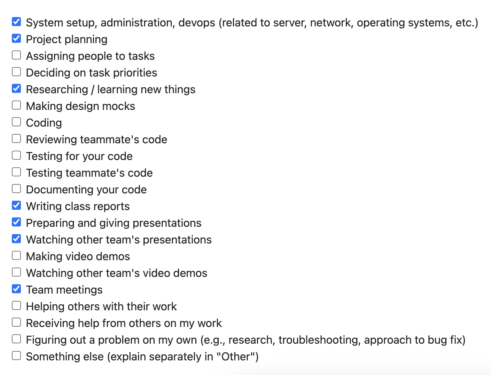

# Week 1, Sept. 15–21 

## Peer Eval

## Recap
This week's goal was to start laying the foundation for our project by discussing potential technologies/the tech stack we want to use, figuring out what each member's strong suit(s) are, and and overall plan of attack for year.

I personally worked on writing the nonfunctional requirements for our requirements document and researching the viability of using Electron for a cross-platform desktop app.