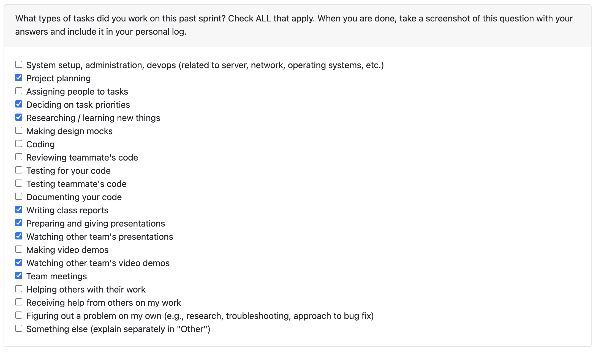

# Week 1 09/15 - 09/21

### Peer Eval

### Recap on your week's goals
For this week, the focus was on developing a high-level overview of our project and finalizing the requirements document. I contributed by helping to specify both the functional and non-functional requirements, making sure that new ideas were placed under the correct sections and that everything flowed clearly. I also worked on refining the wording so the document would read more professionally and consistently.
