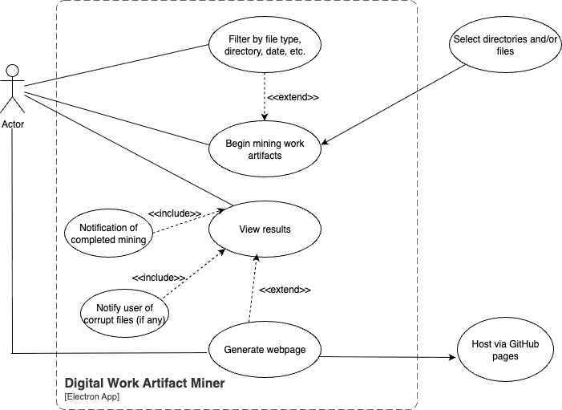
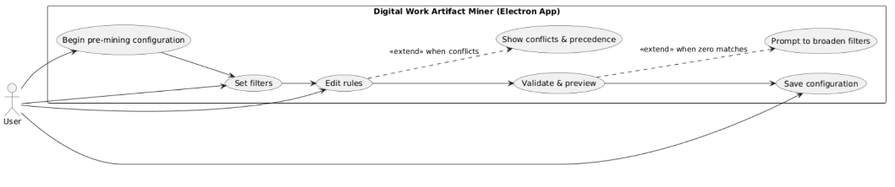
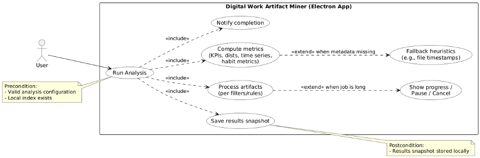
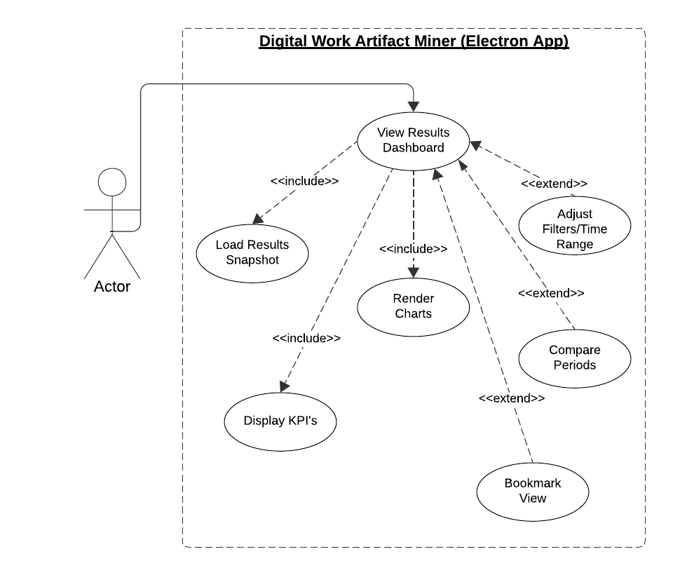
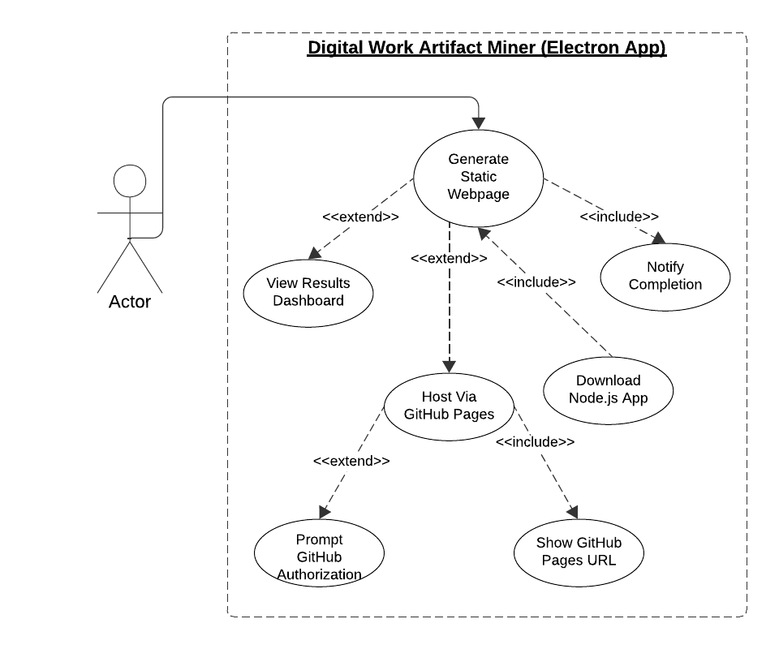

# Project Plan & Features Proposal

Team Number: 18

Team Members:

- Jimi Ademola
- Priyansh Mathur
- Tawana Ndlovu
- Erem Ozdemir
- Sam Sikora
- Alex Taschuk

## **Project Scope and Usage Scenario**

The following project defines a digital work artifact mining tool to generate insights about a user's previous work. This application will be utilized by people who want to gain insights into either their professional or creative activities. The tool will mine data from the metadata of digital artifacts (such as `.docx`, `.pdf`, or `.txt`), and this data will then be processed and presented with visualizations and key statistics about their productivity, habits, and professional development.

## **Proposed Solution**

For this project, we will develop a multi-platform desktop application. The user will download an executable file (.exe, .dmg, etc.) that corresponds to their device's operating system. The application will be built using Electron, React (to serve the frontend), and Node.js to handle user interaction and backend logic. Our app will offer a unique feature that allows users to generate a static website, which can be uploaded to a GitHub repository and hosted using GitHub Pages. This feature will display the results and/or conclusions generated, enabling users to share them with others seamlessly. Additionally, users will be able to configure and customize what the program will look for (e.g., filter by PDF, JPEG, and TXT files) and view their results in the Electron app.

## **Use Cases**

### Use Case 1: Install & First-Run Setup

- **Primary actor:** User
- **Description:** The process of installing the application and completing the one-time local setup.
- **Precondition:** The user will have to download the correct install file, depending on their OS (e.g., `.exe` or `.dmg`).
- **Postcondition:** The app is now installed and ready for use.

**Main Scenario:**

1. User downloads the install file.
2. User runs the installer and opens the application.
3. User clicks the "Get Started" / setup wizard.
4. User selects default folders to analyze and sets preferences.
5. System validates folder access and preferences.
6. If valid, the system saves the local configuration.
7. The system displays a confirmation that setup is complete.

**Extensions**:

- If the user has installed the wrong file for their OS, an error message should display.
- If an invalid folder path is chosen in Step 3, the system notifies the user and requests a valid path.
- If permissions are missing in Step 4, the system prompts the user to grant OS access.

### Use Case 2: Pre-Mining Configuration (Filters & Rules)

- **Primary actor:** User
- **Description:** Setting date range, file types, inclusion/exclusion, and classification rules.
- **Precondition:** A local index of artifacts exists.
- **Postcondition:** An analysis configuration is saved for future runs.

**Main Scenario:**

1. User opens **Analysis Settings**.
2. User can make modifications to the file date range, file types, and inclusion/exclusion folders.
3. User creates/edits classification rules (e.g., “documentation,” “research”).
4. System validates the configuration and shows matched counts.
5. User saves the configuration.

**Extensions:**

- If rules conflict in Step 3, the system highlights conflicts and suggests precedence.
- If zero artifacts match in Step 4, the system prompts to broaden filters.

### Use Case 3: Run Analysis Job

- **Primary actor:** User
- **Description:** Executing the mining pipeline to compute statistics, trends, and insights locally.
- **Precondition:** A valid analysis configuration and index exist.
- **Postcondition:** A results snapshot with computed metrics/insights is stored locally.

**Main Scenario:**

1. User clicks **“Run Analysis”**.
2. System processes artifacts per filters/rules.
3. System computes KPIs, distributions, time series, and habit metrics.
4. System saves the results snapshot.
5. System notifies the user that the analysis is complete.

**Extensions:**

- If the job is long in Step 2, the system shows progress and allows pause/cancel.
- If metadata is missing in Step 3, the system uses fallback heuristics (e.g., file timestamps).

### Use Case 4: View Results Dashboard (Visualizations & Key Performance Indicators)

- **Primary actor:** User
- **Description:** Viewing interactive charts and key metrics about productivity and habits.
- **Precondition:** At least one completed analysis exists.
- **Postcondition:** None (read-only view presented).

**Main Scenario:**

1. User navigates to Dashboard.
2. System displays KPIs (e.g., documents created/edited, active days).
3. System renders charts (trends, distributions, heatmaps).
4. User adjusts filters/time ranges.
5. System updates charts and KPIs accordingly.

**Extensions:**

- User toggles Compare Periods (e.g., last month vs. this month); system renders a comparison view.
- User bookmarks the current dashboard view; system saves the bookmark.

### Use Case 5: Generate Static Webpage & Prompt to Host on GitHub Pages

- **Primary actor:** User
- **Description:** User generates a static webpage that displays the results.
- **Precondition:** The results dashboard must be displayed as the button to generate the webpage will appear on it.
- **Postcondition:** A basic Node.js app with the user’s results is created in their `/Downloads` folder, and possibly a GitHub Pages site.

**Main Scenario:**

1. User selects `Generate Results Webpage` button on the results dashboard
2. User is prompted whether or not they would like the webpage to be automatically hosted on a GitHub Pages site as well.
3. If user selects “No,” only a Node.js app is downloaded to their `/Downloads` folder. If user selects “Yes,” a POST request is made to GitHub’s API to create a GitHub Pages site.

- Note: If the user has not configured any authorization details with GitHub, they will be prompted to do so, and any auth keys will be stored locally and/or generated on the fly as needed.

4. User is notified that a local webpage has been created in their \`/Downloads\` folder. Additionally, if the user selected “Yes,” they are given the URL that can be used to access the GitHub Pages site.

## **4 Requirements, Testing, Requirement Verification**

### **Technology Stack**

| Technology | Description                                                                                                                                      |
| ---------- | ------------------------------------------------------------------------------------------------------------------------------------------------ |
| Electron   | A framework we will use to create the desktop app                                                                                                |
| React      | A library to serve the frontend of the Electron app                                                                                              |
| Node.js    | A runtime environment that will serve the backend logic for user interaction with the frontend                                                   |
| Jest       | A JavaScript Testing Framework used to write and run unit tests for Node.js logic and component/integration tests for React and Node components. |

| Requirement                                      | Description                                                                                                                                                                                                                                                                                                                                                                   | Test Cases                                                                                                                                                                                                                                                                                                                                                                                   | Who      | E/M/H |
| ------------------------------------------------ | ----------------------------------------------------------------------------------------------------------------------------------------------------------------------------------------------------------------------------------------------------------------------------------------------------------------------------------------------------------------------------- | -------------------------------------------------------------------------------------------------------------------------------------------------------------------------------------------------------------------------------------------------------------------------------------------------------------------------------------------------------------------------------------------- | -------- | ----- |
| R1: Easy, one-download installation.             | The entire application should be able to be downloaded and installed through a single executable file (e.g., .exe, .dmg). Difficulty involves cross-OS packaging and initial file access permissions.                                                                                                                                                                         | Positive: User downloads and runs the correct installer for their OS. Verify the app launches.  Negative: User runs the wrong installer (e.g., .exe on macOS). Verify an OS-appropriate error message is displayed and installation is blocked (Use Case 1 Extension).                                                                                                                 | Alex     | E     |
| R2: App prompts for initial configuration.       | On the first run, the app must guide the user through a setup wizard to select initial folders to analyze and set local preferences.                                                                                                                                                                                                                                          | Positive: Complete setup successfully. Verify configuration is saved locally.   Negative: User selects an invalid folder path (e.g., path doesn't exist). Verify the system notifies the user and requests a valid path (Use Case 1 Extension).   Negative: User denies folder access permissions. Verify the system prompts the user to grant OS access (Use Case 1 Extension). | Alex     | M     |
| R3: User can select filters and rules for files. | The application must allow the user to modify analysis parameters: date range, file types (inclusion/exclusion), and specific folder inclusion/exclusion lists.                                                                                                                                                                                                               | Positive: User configures filters and saves. Verify the configuration is correct and accurate.  Negative: The user enters a date range where the start date is after the end date. Verify that the validation error prevents saving.                                                                                                                                                   | Jimi     | M     |
| R4: Artifact classification rule definition.     | The user must be able to create, edit, and manage custom classification rules (e.g., "Documentation," "Research") to categorize files for analysis.                                                                                                                                                                                                                           | Positive: User creates a new rule (e.g., filename contains 'draft'). Verify the rule is saved.  Negative: User defines two rules that conflict (e.g., Rule A: `filetype=doc`, Rule B: `filetype=doc`). Verify the system highlights the conflict (Use Case 2 Extension).                                                                                                               | Tawana   | E     |
| R5: Live count of matching artifacts.            | Before saving, the system must validate the analysis configuration and provide a count of artifacts that match the current filters and rules.                                                                                                                                                                                                                                 | Positive: Filters are set. Verify the matching artifact count updates instantly and accurately.  Negative: Filters are too strict, resulting in a count of zero. Verify the system prompts the user to broaden the filters (Use Case 2 Extension).                                                                                                                                     | Tawana   | M     |
| R6: Ability to run the analysis job.             | The user must be able to initiate the data mining pipeline based on the saved configuration.                                                                                                                                                                                                                                                                                  | Positive: Click "Run Analysis." Verify the job starts, processes files, and saves a results snapshot locally.  Negative: Click "Run Analysis" without a saved configuration. Verify a prompt alerts the user to configure first.                                                                                                                                                       | Sam      | M     |
| R7: Analysis progress visualization and control. | For long jobs, the system must show real-time progress (e.g., percent complete, files processed) and allow the user to pause or cancel the job.                                                                                                                                                                                                                               | Positive: Start a long job. Verify progress bar/indicator is visible and updates. Click "Pause." Verify processing stops.  Negative: Click "Cancel." Verify the job terminates and no partial results are saved (Use Case 3 Extension)                                                                                                                                                 | Priyansh | M     |
| R8: Results generation despite missing metadata. | The system should be robust enough to complete the analysis even if required metadata (e.g., author) is missing, by using fallback heuristics (e.g., file timestamps).                                                                                                                                                                                                        | Positive: Run analysis on a file missing 'last edited by' metadata. Verify the system uses the file's 'modified time' as a fallback metric (Use Case 3 Extension).                                                                                                                                                                                                                           | Erem     | H     |
| R9: Interactive Results Dashboard.               | The application must display computed KPIs (e.g., active days, document counts) and interactive visualizations (trends, heatmaps) of the analysis results.                                                                                                                                                                                                                    | Positive: Navigate to the Dashboard. Verify KPIs and initial charts load correctly from the latest snapshot.  Negative: Navigate to the Dashboard without any completed analysis. Verify a message prompts the user to run an analysis job.                                                                                                                                            | Priyansh | H     |
| R10: Dynamic filtering of results data.          | The user must be able to adjust filters (e.g., time range) directly on the Dashboard, and the displayed charts and KPIs must update in real-time.                                                                                                                                                                                                                             | Positive: Change the time range filter (e.g., 'Last 30 Days' to 'Last 7 Days'). Verify all visible charts/KPIs update to reflect the new range.                                                                                                                                                                                                                                              | Jimi     | M     |
| R11: Static web export of results.               | Users may want to showcase their productivity to others by presenting their report generated by our application on a website. Our application should make this a one click button to export the report as HTML, JS, CSS files that are ready to host. Complexity will come from having to create a template webpage and dynamically adding in content from the user’s report. | Positive: Click "Generate Webpage." Verify a folder containing the static assets is created in the user's default downloads location  Negative: A user without a report tries to export to a website. The program should error out.                                                                                                                                                    | Sam      | M     |
