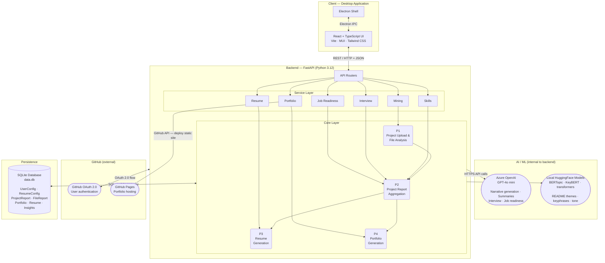
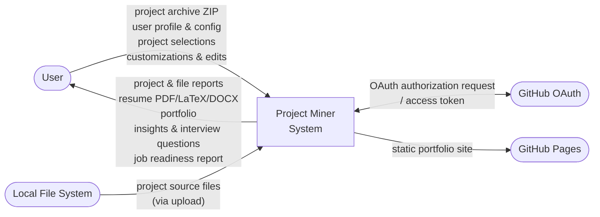
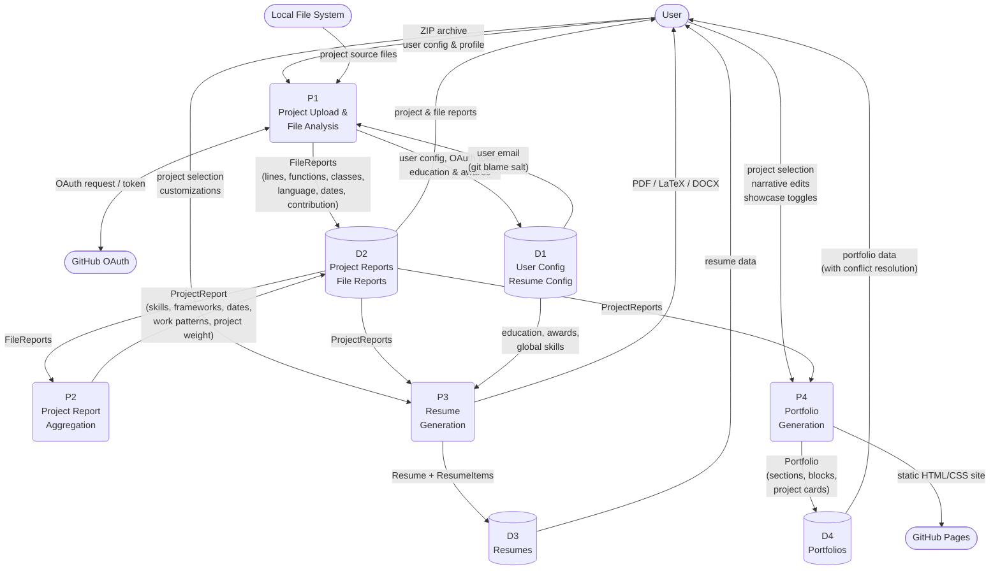

# Project Miner — System Diagrams

---

## 1. System Architecture

Shows the full deployment topology: the desktop application layers, backend layers, persistence, AI/ML services, and external GitHub services.

---

## 2. DFD Level 0 — Context Diagram

Shows the system as a single process with all external entities and top-level data flows across the system boundary.

---

## 3. DFD Level 1 — System Processes

Decomposes the system into 4 core processes, 4 data stores, and the same external entities from Level 0.

**External Entities:** User / GitHub OAuth / GitHub Pages / Local File System
**Data Stores:** D1 User Config/Resume Config / D2 Project Reports/File Reports / D3 Resumes / D4 Portfolios

