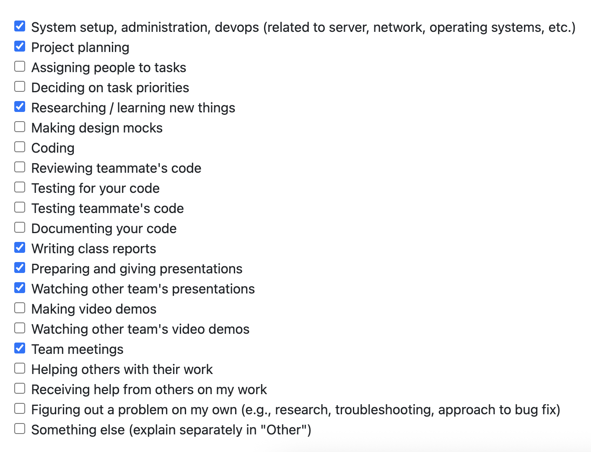

# Alex Taschuk Personal Log

## Table of Contents

**[Week 3, Sept. 15–21](#week-3-sept-1521)**

**[Week 4, Sept. 22–28](#week-4-sept-2228)**

**[Week 5, Sept. 29 – Oct. 05](#week-5-sept-29--oct-05)**

## Week 3, Sept. 15–21 

### Peer Eval

### Recap
This week's goal was to start laying the foundation for our project by discussing potential technologies/the tech stack we want to use, figuring out what each member's strong suit(s) are, and and overall plan of attack for year.

I personally worked on writing the nonfunctional requirements for our requirements document and researching the viability of using Electron for a cross-platform desktop app.

## Week 4, Sept. 22–28

### Peer Eval

### Recap
My goals for this week were to work with my team to create the system arcitecture, define specific features for the app, and brainstorm ideas for implementation and unique features that would make our app stand out. 

I led our team's brainstorming session and later assigned each person in our team to different parts of the project plan document. My contributions to the document were the proposed solution, the UML use case diagram, some of the use case descriptions, and the tech stack table.

## Week 5, Sept. 29 – Oct. 05

### Recap
My goals for this week were to support my teammates who were making the DFD and communicate feedback I got from other teams about our diagrams. Additionally, I completed the team log for this week.