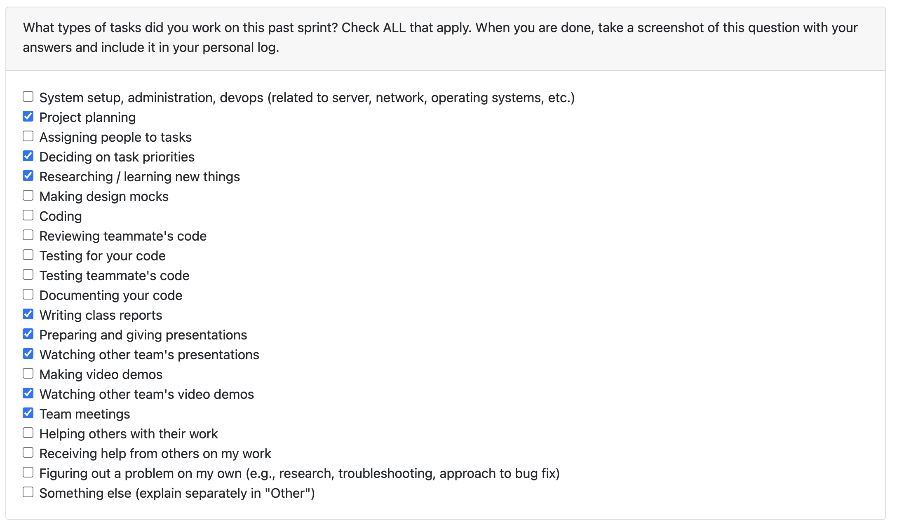
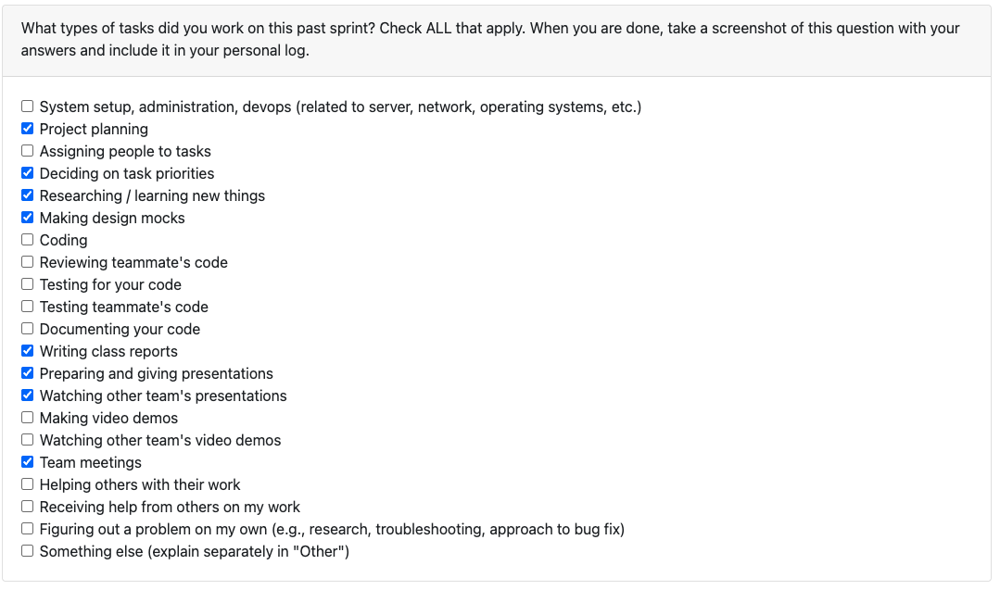
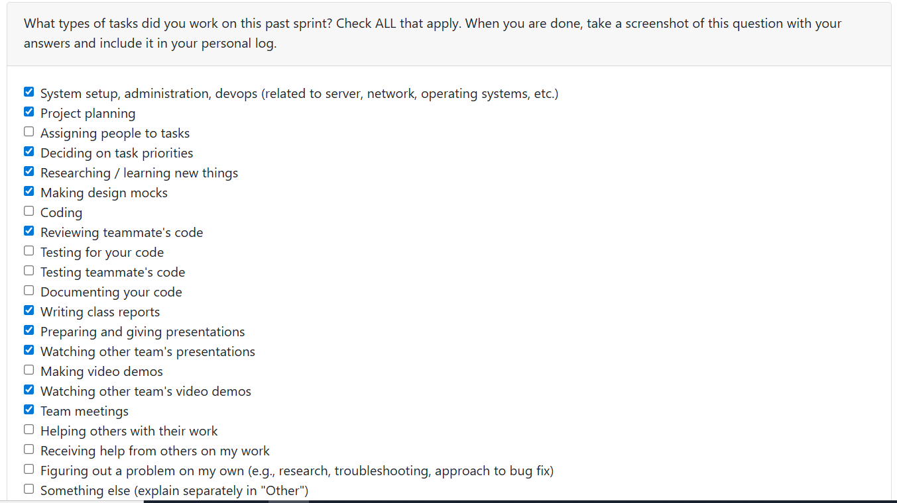
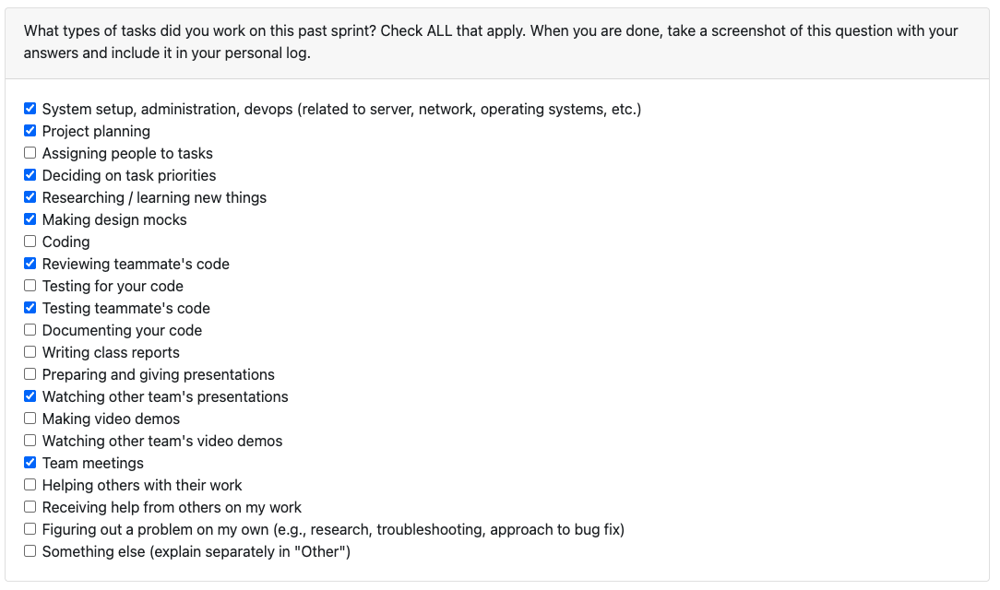
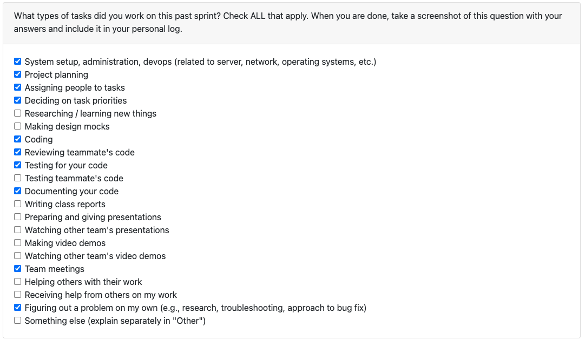

# Erem Ozdemir Personal Log

## Table of Contents

**[Week 3, Sept. 15–21](#week-3-sept-1521)**

**[Week 4, Sept. 22–28](#week-4-sept-2228)**

**[Week 5, Sept. 29–Oct. 5](#week-5-sept-29-oct-5)**

**[Week 6, Oct. 06–12](#week-6-oct-6-12)**

**[Week 7, Oct. 07–19](#week-7-oct-0719)**

**[Week 8, Oct. 20–26](#week-8-oct-2026)**

**[Week 9, Oct. 27 – Nov. 02](#week-9-oct-27--nov-02)**

### Peer Eval

### Recap
For this week, the focus was on developing a high-level overview of our project and finalizing the requirements document. I contributed by helping to specify both the functional and non-functional requirements, making sure that new ideas were placed under the correct sections and that everything flowed clearly. I also worked on refining the wording so the document would read more professionally and consistently.

### Peer Eval

### Recap
This week I focused on reviewing and refining our system architecture. I compared our design with other teams, identified strengths and weaknesses, and contributed to improving the overall clarity. Additionally, I worked with my teammates in meetings to flesh out the proposal and architecture diagram, and helped brainstorm different approaches to make our project stand out.

### Peer Eval

### Recap
This week, I worked with Jimi to finalize our DFD and ensure the data flow accurately represented our system’s processes. He started the DFD and after feedback from the group and I refined both the Level 0 and Level 1 diagrams for clarity and consistency. I also contributed to general group discussions and adjustments to improve how our diagrams aligned with our system’s functionality.

### Peer Eval

### Recap
With the new requirements for Milestone #1, our team needed to adjust parts of our project design. I worked closely with Alex to update our Level 0 and Level 1 DFDs to reflect the new system structure that he and Sam developed. Throughout the process, I made edits to ensure the diagrams accurately represented the revised data flow and clarified a few points about how the new design would integrate with our existing components. I also participated in team discussions to review the updated architecture and confirm that everyone was aligned before submission.

### Peer Eval

### Recap
This week I focused on adding cli functionality and comprehensive testing for the cli. Working primarily with Alex, I contributed to developing the cancel/back navigation feature for the command-line interface, which allows users to return to the main menu from any input prompt. I helped design and implement the `_handle_cancel_input()` helper method that provides consistent cancel handling across all CLI functions, ensuring users can type 'back' or 'cancel' from permissions, filepath, or any other screen.

Additionally, I worked extensively on creating comprehensive test coverage for the CLI functionality. I developed over 20 test cases in `test_app_cli.py` that cover initialization, command routing, user interactions, error handling, and complete workflow integration. The tests use mock-based approaches to simulate user input and verify CLI responses, including edge cases like whitespace handling and invalid commands.

To support these technical implementations, I contributed to updating the CLI documentation with a complete user guide that includes command reference tables, step-by-step workflows, and troubleshooting sections. This week's work directly addresses issues #38 (CLI cancel command) and #41 (CLI test cases), combining them into a cohesive feature update that  improves the user experience and code reliability of our CLI component.
- This can be found in the PR [here](https://github.com/COSC-499-W2025/capstone-project-team-18/pull/53)

I also reviewed PR's [37](https://github.com/COSC-499-W2025/capstone-project-team-18/pull/37), which was the inital CLI tool creation.

## Week 8, Oct. 20–26

### Recap
This week I focused on implementing core functionality for the ProjectReport class and addressing a CLI bug. My primary contribution was developing the project timeline calculation feature in the `ProjectReport.__init__` method, which aggregates file-level statistics to determine project start and end dates.

I implemented logic to extract creation and modification dates from FileReport objects, calculate the earliest creation date as the project start date, and find the latest modification date as the project end date. The implementation includes proper error handling for missing date information and follows the established pattern of wrapping calculated values in Statistic objects using ProjectStatCollection templates.

To ensure code reliability, I created comprehensive unit tests in `test_project_report.py` with over 8 test cases covering basic functionality, edge cases (empty file lists, single files, missing dates), complex scenarios with multiple files, and negative assertions using assertFalse to verify incorrect assumptions. The tests also validate inheritance behavior and ensure BaseReport methods work properly.

During the development process, I encountered and resolved several technical challenges including import errors with FileStatCollection and ProjectStatCollection, and fixed a critical bug where the project end date calculation was incorrectly using creation dates instead of modification dates. I also worked through merge conflicts when integrating with the dev branch, successfully combining my file-based initialization approach with existing Git analysis functionality into a unified constructor with optional parameters.

Additionally, I collaborated with team members on code review feedback, implementing suggestions to eliminate redundant conditional checks and improve code efficiency. This work directly supports our project's core functionality of analyzing and reporting on software development metrics and timelines.

The implementation can be found in PR ([#98](https://github.com/COSC-499-W2025/capstone-project-team-18/pull/98)) and addresses issue requirements for project-level statistical aggregation and temporal analysis. I also reviewed Alex's Database Initialization PR ([#96](https://github.com/COSC-499-W2025/capstone-project-team-18/pull/96)) and Sam's github pytest action PR ([#87](https://github.com/COSC-499-W2025/capstone-project-team-18/pull/87)).

## Week 9, Oct. 27–Nov. 2

### Recap
This week I implemented a comprehensive file analysis system for the `FileReport.create_with_analysis()` method that automatically detects file types and applies specialized analyzers. The system supports natural language files (.md, .txt, .rst) with word count, character count, sentence count, and ARI score statistics, as well as code files (.py, .js, .java) with function/class counting and import analysis.

I addressed key technical challenges including division-by-zero protection in ARI score calculations for edge cases like files without punctuation or empty files. I also implemented the factory pattern `get_appropriate_analyzer()` function for file type routing with case-insensitive extension matching.

For testing, I created an extensive test suite with 25+ test cases covering all analyzers, edge cases, and integration scenarios, then converted the entire suite from unittest to pytest using fixtures, parametrized tests, and pytest best practices.

This work addresses issues #112 (Add Natural Language Statistic to FileReportClass) and #113 (Measure ARI Score for FileReportClass), providing a unified solution for comprehensive project analysis across diverse technology stacks. The implementation can be found in PR ([#131](https://github.com/COSC-499-W2025/capstone-project-team-18/pull/131)). I also reviewed Priyansh's project-level aggregate stats PR ([#132](https://github.com/COSC-499-W2025/capstone-project-team-18/pull/132)) and Sam's CLI incorrect filepath err handling PR ([#138](https://github.com/COSC-499-W2025/capstone-project-team-18/pull/138)).

## Week 10, Nov. 3-9

### Peer Eval

### Recap
This week I implemented the foundational JSON preferences system for our CLI application, establishing persistent user data storage across sessions. I developed the complete UserPreferences class with core methods for loading, saving, updating, and retrieving user preferences, then integrated this system into existing CLI commands (do_perms, do_filepath, do_email, do_begin) to automatically persist user consent, project filepaths, and email configurations.

The implementation involved a significant amount of code including comprehensive error handling, backwards compatibility support, and proper file system management within the database folder structure. This work represents the first PR stage of the  CLI User Prefrences and can be found in PR [#181](https://github.com/COSC-499-W2025/capstone-project-team-18/pull/181), laying the groundwork for advanced user credential management and configuration options in subsequent releases. I also reviewed Alex's PR [154](https://github.com/COSC-499-W2025/capstone-project-team-18/pull/154).

## Week 11, Nov. 10-6

### Peer Eval

(No Peer eval this week)

### Recap
This week I completed the second stage of the CLI User Preferences system implementation. I finalized PR [#181](https://github.com/COSC-499-W2025/capstone-project-team-18/pull/181) by addressing all requested changes including fixing test failures, removing duplicate method definitions, and ensuring proper preference loading consistency.

Building on that foundation, I successfully implemented and merged PR [#186](https://github.com/COSC-499-W2025/capstone-project-team-18/pull/186) which added the complete user login and credentials system. This included developing the `do_login()` method with input validation and retry loops, adding credential storage methods to UserPreferences, and integrating the new "(5) User Login" option into the CLI command routing system. The implementation features secure password display, persistent credential storage, and proper integration with existing preference management.