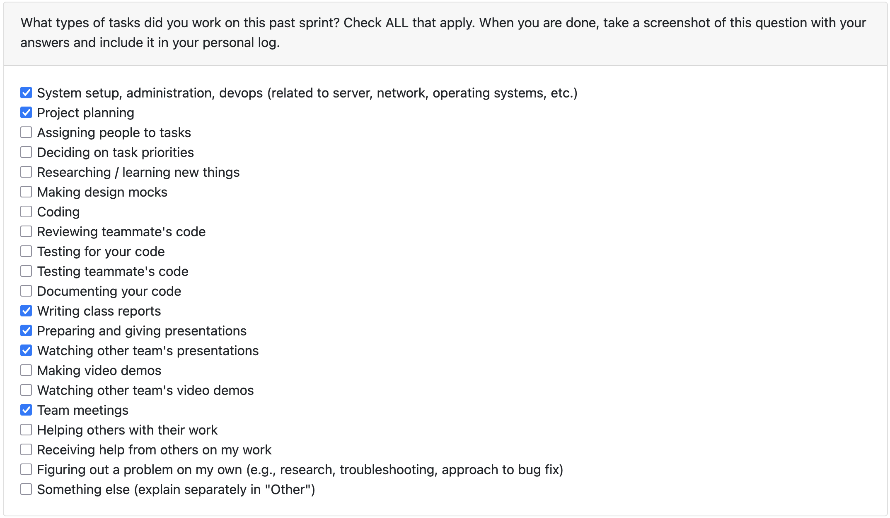
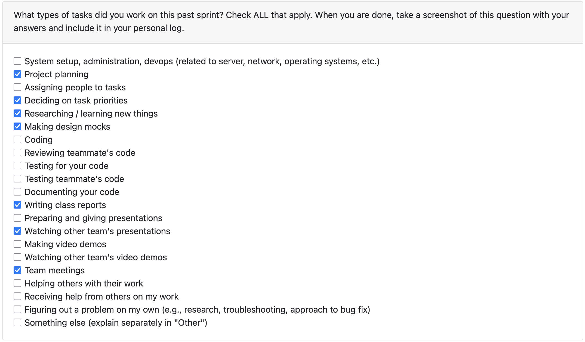
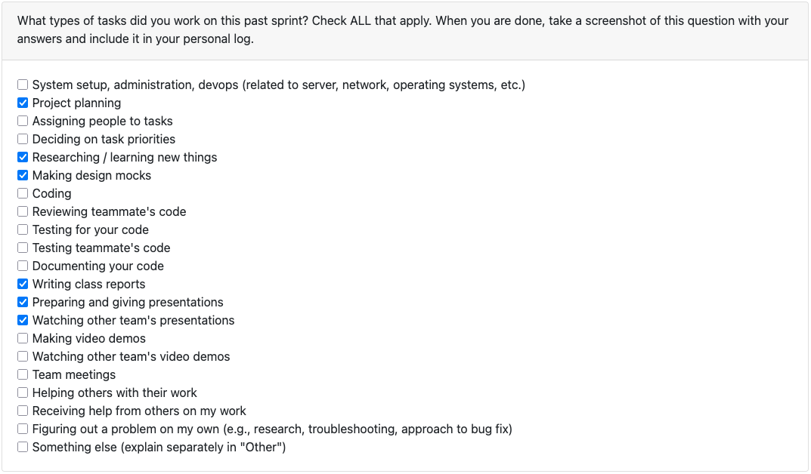
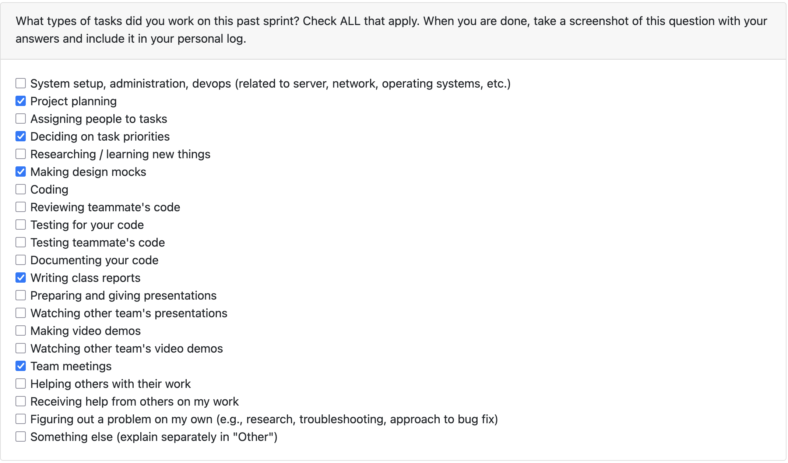
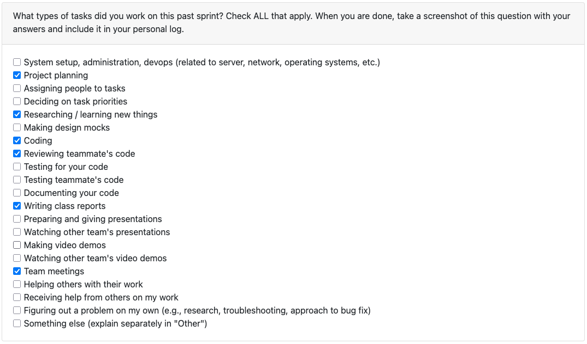
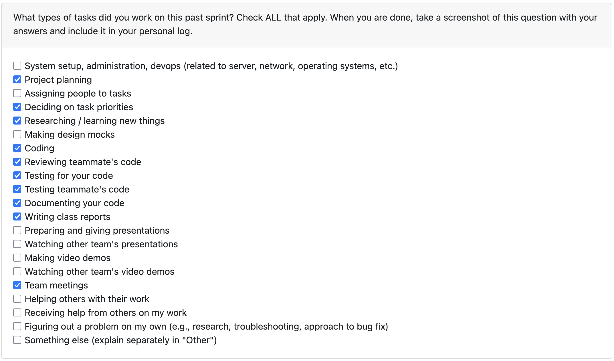
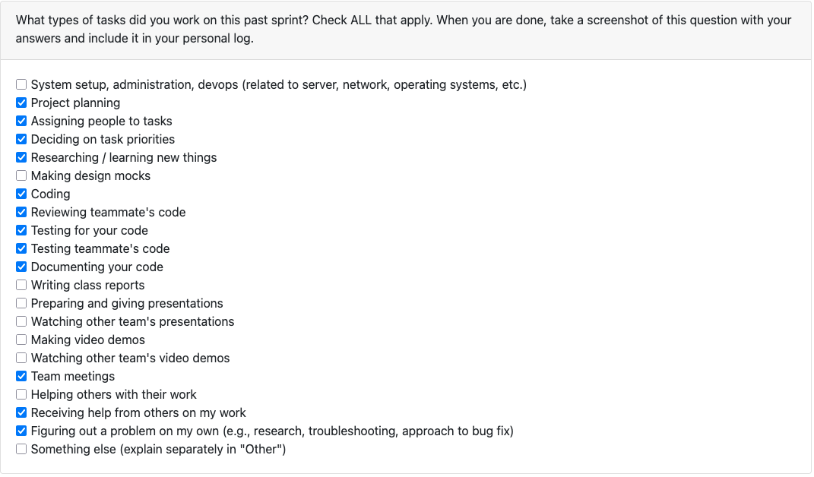

# Jimi Ademola Personal Log

## Table of Contents

**[Week 3, Sept. 15–21](#week-3-sept-1521)**

**[Week 4, Sept. 22–28](#week-4-sept-2228)**

**[Week 5, Sept. 29–Oct. 5](#week-5-sept-29-oct-5)**

**[Week 6, Oct. 6–12](#week-6-oct-612)**

**[Week 7, Oct. 13-19](#week-7-oct-1319)**

**[Week 8, Oct. 20-26](#week-8-oct-2026)**

**[Week 9, Oct. 27-Nov. 2](#week-9-oct-27-nov-2)**

**[Week 10, Nov. 3-9](#week-10-nov-39)**

**[Week 12, Nov. 17-23](#week-12-nov-1723)**

**[Week 13, Nov. 24-30](#week-13-nov-2430)**

## Week 3, Sept. 15–21

### Peer Eval

### Recap

This week's goals were to finish the requirements and I was assigned to complete the functional requirements and print the sheets before class. Nothing has been added to the project board as of yet as that has been reserved for development.

## Week 4, Sept. 22–28

### Peer Eval

### Recap

This week's goals were to finish the project proposal, system architecture and define our tech stack. My tasks this week were, as usual, completing the team logs. Additionally, I worked within our meetings to flesh out our proposal and system architecture diagram. This included some writing use cases and the requirements section.

## Week 5, Sept. 29 - Oct. 5

### Peer Eval

### Recap

This week's goals were to finish the DFD diagram and understand the data flow of our system. My role was to complete the DFD before the first class. I took feedback from the group and completed the diagram. We then spent the rest of the week adjusting and improving bot the Level 0 & 1 diagrams.

## Week 6, Oct. 6–12

### Peer Eval

### Recap

This week's goals were to rework our documentation to more closely be aligned with the class requirements. I was responsible for consolidating these changes into the README. I also reworked the WBS by changing the requirements to follow the format necessary for a CLI over.

## Week 7, Oct. 13–19

### Peer Eval

### Recap

This week's goals were to flesh out classes for our code and create a baseline for the project. We wanted to build out the initial CLI interface and create parent classes which will act as placeholders for analysis and statistics. My role during this week was to flesh out the issues page and project board such that everyone knew what was available and needed for development. This also allowed us to understand what could be combined into the same features. Additionally, I worked on the logic for fetching metadata based on the user's operating system.

## Week 8, Oct. 20-26

### Peer Eval

### Recap

This week's goals were to create an end-to-end workflow for the artifact miner which made minor assessments about files given a zip file. This would allow us to expand upon this flow, adding complexity and depth. The week started with a monday meeting where we examined requirements, their related dev area and assigned them amongst each other. Then we meet on Wednseday to track our progress again. This week I focused on generating FileReports for a project. This acted as a bridge for the other methods being worked on. Additionally, I fleshed out the issues page, project board and merged and tested my team's PRs.

## Week 9, Oct. 27 - Nov. 2

### Peer Eval

### Recap

This week's goals were to expand on the end-to-end workflow for the artifact miner which made minor assessments about files and projects given a zip file. This week individually I began our expansion into tracking Git based contribution features. I added a commit percentage STATISTIC which given a repo with multiple authors tracks how many commits are from the user. This is an expansion of the `_analyze_git_authorship` function in `report.py`. I wrote tests for this file and reviewed the error handling filepath changes and changes to the database.

## Week 10, Nov. 3-9

### Peer Eval

### Recap

This week's goals as a team were to create more specifications within the project and work towards the demo for Milestone 1. I worked on expanding the depth of the individual contribution milestone. After adding a project wide contribution metric, this week I worked on using `git blame` to analyze this statistic for individual files. This will be expanded upon in the future, by aggregating across a project and getting an overview of 'ownership' in a project. Beyond this week and even Milestone 1, is analyzing sections committed by the user to find key skills and insights. As part of the group, I extensively reviewed Priyansh's PRs on our handling of zip files as we had spent time discussing it in class. I also reviewed Sam's language identifier and the documentation on the DB by Alex, which both gave a clear indication of the project direction.

## Week 12, Nov. 17-23

### Peer Eval

### Recap

This week's goals as a team were to imporve upon the project demo we had created. We needed to add more specifications, including how we calculated the ratio of coding languages, add user preferences and more. This week , one of my roles was to refactor some of the git based features. This meant adding logic to ignore files and adjust behaviour based on whether a user provided an email or if a user didn't commit to a file. This would increase the true accuracy of a report. From that point, I worked on adding more git features such as a comprehensive statistic calculating the true percentage of code a user was responsible for in the final deliverable. All of these functions were tested, reviewed and checked thoroughly by. myself and group members. Apart from my own work, I assisted in code review for multiple PRs including Alex and Priyansh. They were working on database and CLI functionality and were able to merge after we discussed possible areas of improvement. AQs for next week, I hope to review all the contribution style features to ensure they not only work, but refactor where possible to reduce bloat. I also hope to refactor the test directory, add some features to better extrapolate the skills used in each project and increase the global documentation for our project.

## Week 13, Nov. 24-30

### Peer Eval

### Recap

This week's goals as a team were to prepare for the upcoming Milestone 1 demo. To do this we needed to ensure our CLI was fleshed out and usable for not only the developers but for users new to the system. That included creating many interfaces to deal with preferences and other CLI settings. This week I worked on some minor PRs related to that including [#238](https://github.com/COSC-499-W2025/capstone-project-team-18/issues/238) and [#271](https://github.com/COSC-499-W2025/capstone-project-team-18/pull/271) which were focused on some bugs and permissions that weren't previously included. Additionally, after a meeting this week, we decided to aggregate the `git blame` stats that we were tracking individually and get a overview of how much a user committed to a repository by line. This was merged in [#245](https://github.com/COSC-499-W2025/capstone-project-team-18/pull/245) .Currently in review is the expansion of user skills which uses dicts to track if patterns exist in file names or content which signify certain patterns. This additionally weighs them which will later be used in ranking each skill. As for reviews and assisting the group, I reviewed mutliple PRs, including [#257](https://github.com/COSC-499-W2025/capstone-project-team-18/pull/257), [#268](https://github.com/COSC-499-W2025/capstone-project-team-18/pull/268), [#254](https://github.com/COSC-499-W2025/capstone-project-team-18/pull/254).