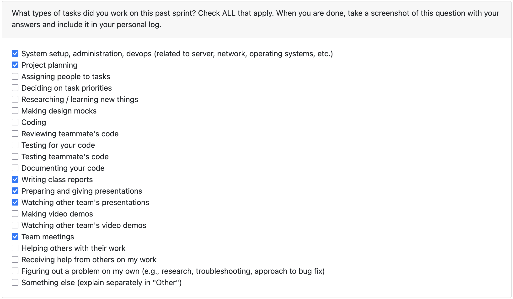

# Jimi Ademola Personal Log

## Table of Contents

**[Week 3, Sept. 15–21](#week-3-sept-1521)**

**[Week 4, Sept. 22–28](#week-4-sept-2228)**

## Week 3, Sept. 15–21

### Peer Eval

### Recap

This week's goals were to finish the requirements and I was assigned to complete the functional requirements and print the sheets before class. Nothing has been added to the project board as of yet as that has been reserved for development.

## Week 4, Sept. 22–28

### Peer Eval

### Recap

This week's goals were to finish the project proposal, system architecture and define our tech stack. My tasks this week were, as usual, completing the team logs. Additionally, I worked within our meetings to flesh out our proposal and system architecture diagram. This included some writing use cases and the requirements section.