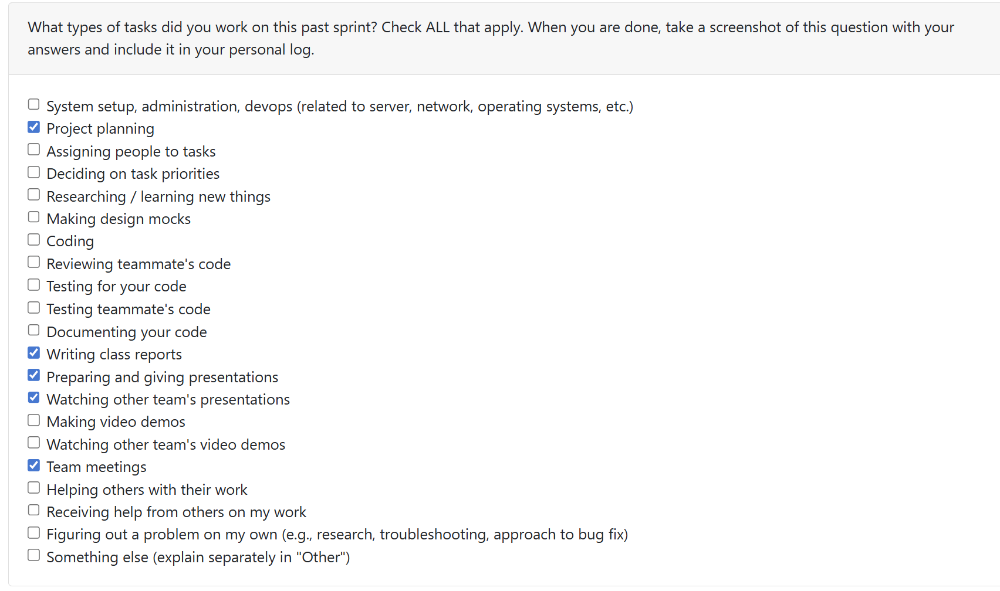
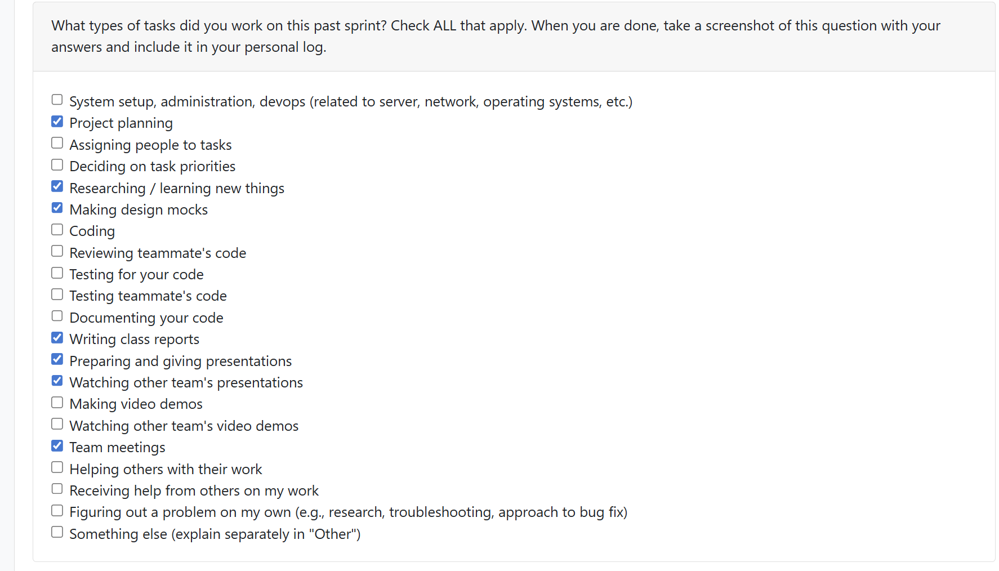
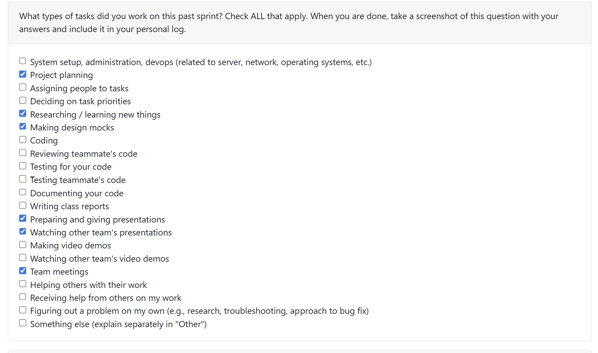
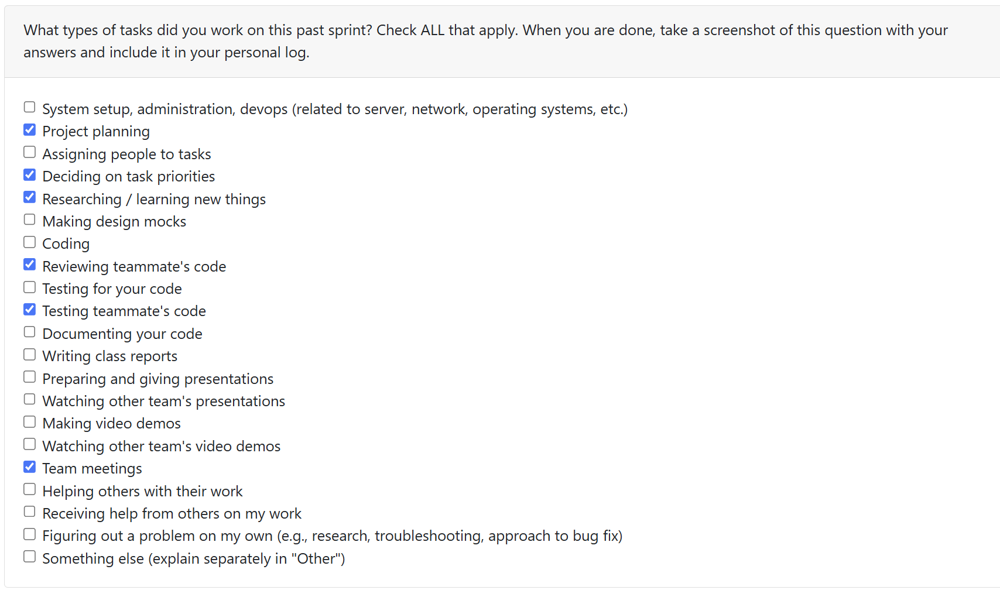
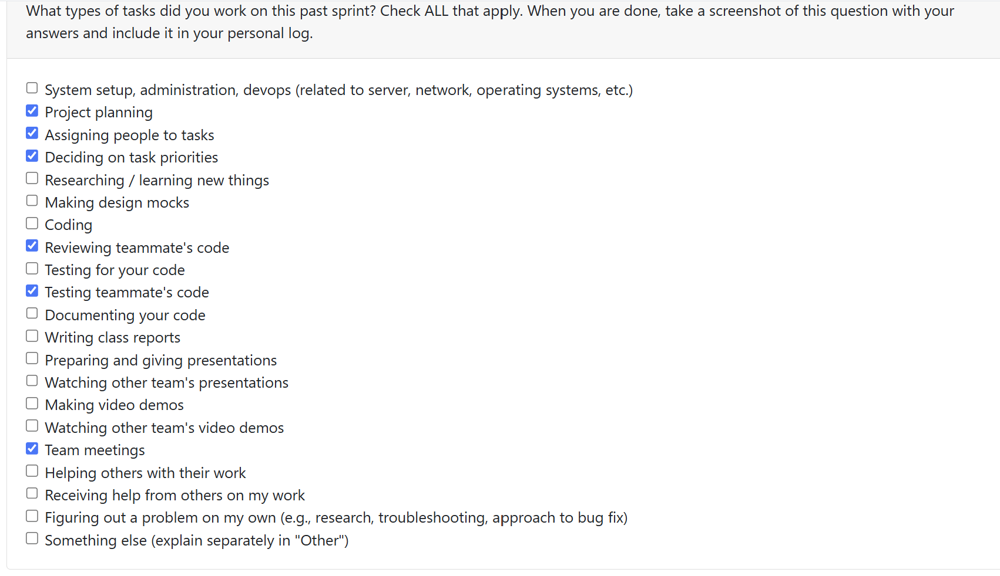
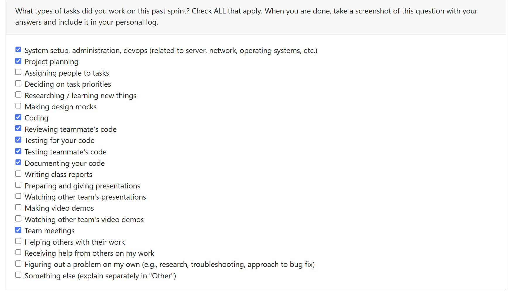
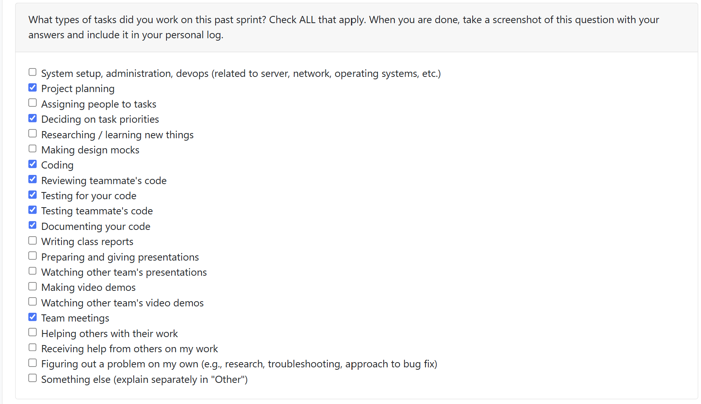

# Priyansh Mathur Personal Log

## Table of Contents

**[Week 3, Sept. 15-21](#week-3-sept-15-21)**

**[Week 4, Sept. 22-28](#week-4-sept-22-28)**

**[Week 5, Sept. 29-Oct. 5](#week-5-sept-29-oct-5)**

**[Week 6, Oct. 6-12](#week-6-oct-6---oct12)**

**[Week 7, Oct. 13-19](#week-7-oct-13-19)**

**[Week 8, Oct. 20-26](#week-8-oct-20-26)**

**[Week 9, Oct. 27-Nov. 2](#week-9-oct-27-nov-2)**

---

## Week 3, Sept. 15-21

### Peer Eval

### Recap
This week's goal was to start laying the foundation for our project by discussing potential technologies/the tech stack we want to use, figuring out what each member's strong suits are, and building an overall plan for the year.

I personally helped by contributing to both the **functional** and **nonfunctional requirements** sections of our requirements document.

---

## Week 4, Sept. 22-28

### Peer Eval

### Recap
My goals for this week were to work on the **use cases**.

My contributions included drafting detailed descriptions of user interactions like running an analysis job, viewing results in a dashboard, and handling cases such as missing metadata or long-running processes. These use cases helped clarify expected system behaviors and were tied directly to requirements and test cases in the project plan.

---

## Week 5, Sept. 29-Oct. 5

### Peer Eval

### Recap
This week’s goals were to begin visualizing the data flow of our system and produce the first draft of the Level 0 and Level 1 Data Flow Diagram.
My role was to design and complete the initial version of the Level 0 DFD. I focused on identifying the main processes, data stores, and external entities involved in the system.
After finishing the draft, I shared it with the group to gather their feedback. We discussed several improvements, including data labeling and flow, which helped me refine the next version of the Level 0 diagram.

## Week 6, Oct. 6 - Oct.12

### Peer Eval

### Recap
This week's goals focused on aligning our project design with Milestone #1 requirements and contributing to documentation reviews.

I collaborated with my team to discuss ideas for modifying our existing design plans to better match the requirements for Milestone #1. These discussions helped us refine our approach to the data flow diagrams and overall system architecture.

Additionally, I reviewed and approved several pull requests to ensure quality and completeness of our team's work. I reviewed Erem's PR , which contained the finalized Milestone 1 DFD Level 0 & 1 diagrams that consolidated our data flow visualization work. I also reviewed Jimi's PR, examining the updated documentation to verify that all use cases, diagrams, and requirements were complete and clearly defined. Lastly, I reviewed Alex's personal and team logs for Week 6, confirming they accurately reflected the week's accomplishments and progress toward Milestone #1.

## Week 7, Oct. 13-19

### Peer Eval

### Recap

This week marked our team transitioned from planning to active development. My primary focus was on creating the team log for Week 7 and reviewing pull requests to ensure code quality and documentation completeness.

I took responsibility for writing the comprehensive team log for Week 7, documenting active development. The log covered the successful merge of 6 pull requests, including our first code implementation (PR #27 - Analyzer, Report, and Statistics classes), the closure of 2 issues, and the creation of 7 new GitHub issues to organize parallel development work.

Additionally, I reviewed and approved PR #44 (Enhanced Documentation for Class Structure). This was a critical PR that added a 100-line README explaining the entire class architecture and how Statistics, Reports, and Analyzers work together. I verified that all 15 test cases were passing and confirmed that the code examples clearly demonstrated how to use the statistics system. I also reviewed the new PR template that was added to standardize future contributions, ensuring it will help the whole team work more efficiently with the codebase as we continue development.

## Week 8, Oct. 20-26

### Peer Eval

### Recap

This week's goal was to implement critical features for our end-to-end workflow and extend code analysis capabilities.

I completed Issue #67, implementing project discovery from zip files with Git-based group detection—a core feature enabling our workflow to start from user uploads. This included creating 6 comprehensive tests covering multiple projects, Mac zip structures, and Git authorship analysis. I also implemented Issue #90, creating JavaAnalyzer and JavaScriptAnalyzer classes using regex-based parsing to extend analysis beyond Python. Both analyzers count classes, functions, and imports, with full test coverage including test fixtures (example_java.java, example_javascript.js).

Additionally, I reviewed PR #87 GitHub Pytest Action by Sam, which adds CI/CD to automatically run tests on every PR. I also reviewed PR #91 on user-readable UserReport formatting by Tawana, providing feedback on test coverage and code consistency.

## Week 9, Oct. 27-Nov. 2

### Peer Eval

### Recap
This week, our team aimed to strengthen the platform’s core by expanding multi-language code analysis, improve reporting, enhancing resume file handling, and refining database flexibility.

I completed Issue #130 by implementing project-level aggregate statistics in ProjectReport. This feature aggregates statistics across all files in a project, allowing users to view comprehensive metrics such as total lines of code, number of classes, and functions at the project level. The implementation required updating the ProjectReport class, integrating aggregation logic, and ensuring compatibility with existing reporting workflows.

I also created the C and TypeScript analyzer PR which completes Issue #122, which extends our code analysis capabilities to new languages. The new analyzers use regex-based parsing to count classes, functions, and imports in C and TypeScript files, mirroring the approach used for Java and JavaScript. This update improves the flexibility of our statistics system and supports more diverse codebases. I wrote and validated tests for these analyzers to ensure accurate results and robust integration.

Both PRs are foundational for expanding our platform's functionality and data aggregation. Additionally, I reviewed two PRs: 'changes for dynamic column generation' by Alex, 'Created Very Basic Resume Class Structure' by Sam, and '142: CSS HTML PHP analyzers'. My feedback focused on code correctness, maintainability, and alignment with project goals.
