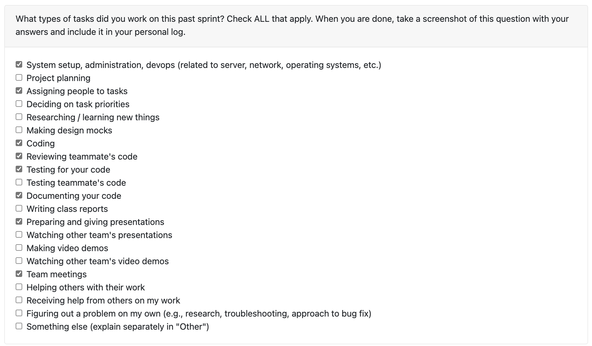
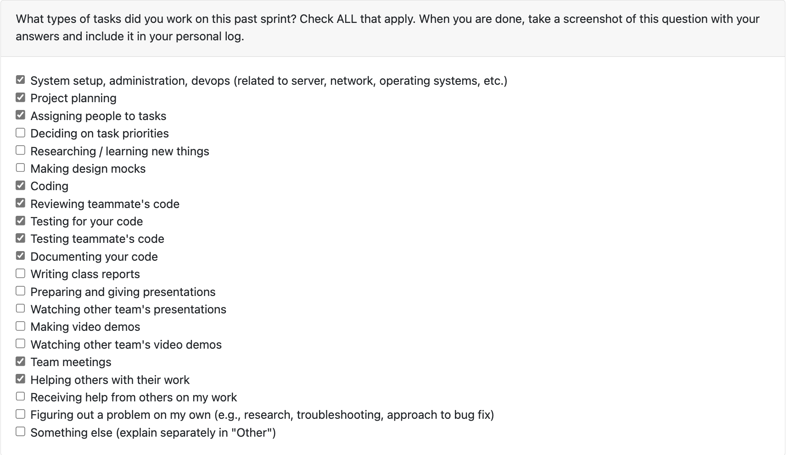
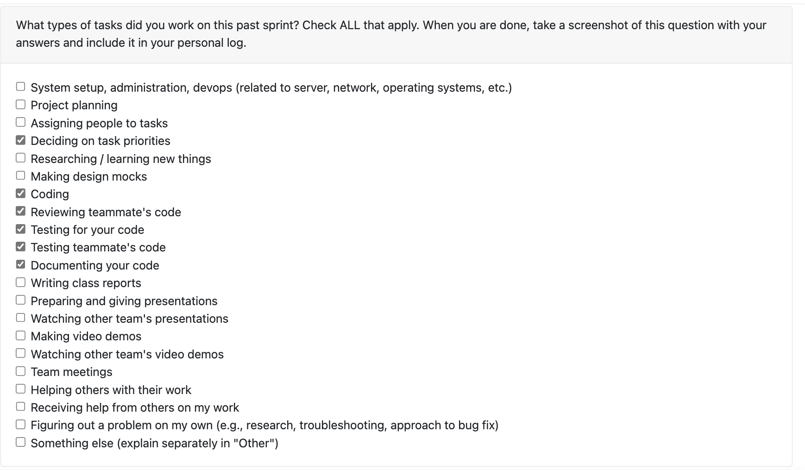
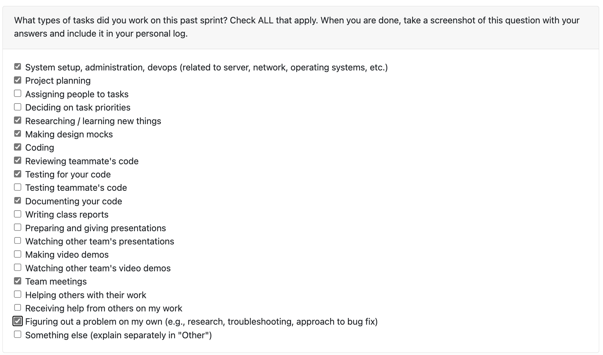
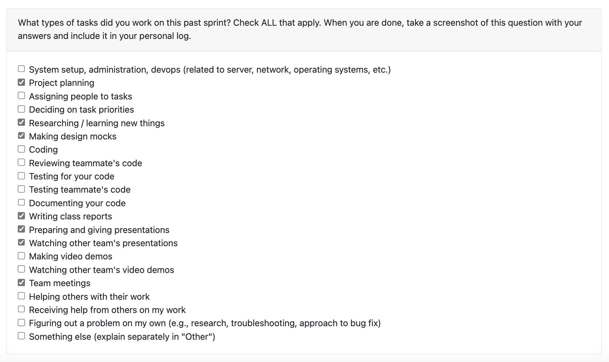
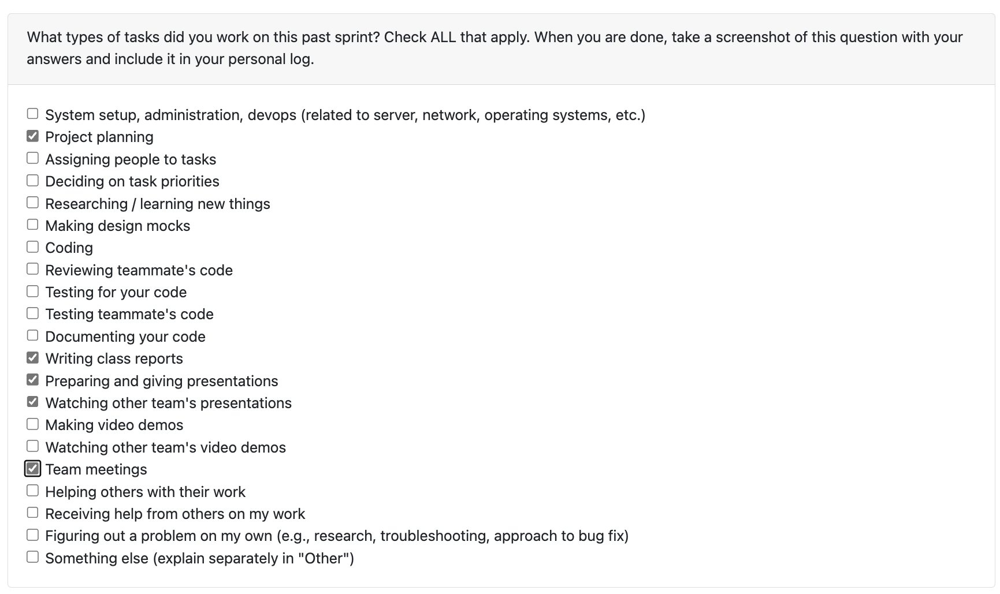

# Week 13 11/24 - 11/30

I completed many different features this week for the deliverable of Milestone #1. First, I created a way to collect and combine many different project skills and rank them against each other. These "User skills" are then included in both the resume and the portfilo (PR #257). Then, I created logic to determine if a code file was a test file (PR #259). Then, using that new logic, I compeleted the milestone requirement of measuring "activity type contribution frequency" by counting how much a user contributed to each file domain (PR #264).

I completed a minor refactor, of our project report class (PR #263) and I refactored our resume class strutcure to adhead to DRY and extendable principles, and I created a new feature that exports the resume to a latex file (PR #273).

I also reviewed these PRS:
- #242
- #265
- #270 In one of my comments, I coded my changes in PR #258 to merge into that branch.
- #272

Looking forward this week to finishing things up for the semester like the presentation and reports!

# Week 12 11/15 - 11/23

This week, I completed the milestone requirement of "Extract key skills from a given project". I identifyed the skills at the project level (PR #206). Next, I completed the milestone of "Output all the key information for a project." I did this by developing the bullet points that would be listed under every project in the resume (skills, coding languages, was it a group project) and handled the printing to the terminal (PR #198).

Because the demo was this week, I found and fixed many different bugs (PRs #201, #190, #191). Then, I focused more the git project processing. I centeralized the way we discover git repos (PR #217), and added git functionality for analyzing project start and end dates. Now, if the file is git tracked, the miner will look at the first commit to get the date that the file is first created, rather then that file's metadata #227.

NOTE: I might have thousands of lines added for this week. This is because I was modifiying the very basic classes, which meant I had to go and modfiy a lot of tests. Also, a lot of the PRs I made were dependent on other PRs, when this happens, the most recent PR also inculdes the number of lines change in the PR it is dependent on. However, I only used Gen AI in good faith, not to write all my code.

I also reviewed these PRs:
 - #231
 - #230 One of the comments I left, I coded my changes up and that spawned a PR #239 to merge into that branch.
 - #220
 - #209
 - #207
 - #199
 - #181
 - #179
 - #178

Looking forward to next week I really want to finish up the milestones. Notably I will be bringing everything together, and looking at:
- Expanding portiflo information
- Supporting development (fixing bugs, wrapping everything together, database support)

# Week 10 11/03 - 11/09

This week, I completed a milestone requirement of "For a coding project, identify the programming language." For every coding language file, we log if it is Python, Ruby, Rust, etc. I also created a "project-level statistic" to measure how much of the coding project is in what language by lines of code (e.g. this project is 20% ruby 50% python 30% shell) PR #168. I also refactor our project start and end date calcuations to be more space efficent. In that same PR I also researched and fixed a bug that was happening with our date created file collection. I also reviewed the database explaination PR #167 and a PR that related to expand the files that we can unzip #169. Although I didn't get as much work I as I wanted (I was pretty busy this week), these are tasks needed to get done to keep hammering away at Milestone #1.

Looking forward to next week, here are the key milestone requirements I want to achieve:
- Rank importance of each project based on user's contributions
- Distinguish individual projects from collaborative projects

# Week 9 10/27-11/02

Peer evaluation was ended at 7:50 am early on Sunday. Here is the checklist of what I did this week:

- Assigning people to tasks
- Deciding on task priorities
- Coding
- Reviewing teammate's code
- Testing for your code
- Testing teammate's code
- Documenting your code
- Helping others with their work

This week I worked on our project discovery functionaility in our code so it could be more extendable, more robust (be able to handle any folder depth) and handle reading files from a temporary directory rather than the zipped file itself (#105). I then tied up all of the work from last week into a completed end-to-end workflow by creating a core application loop (#121). I then created a resume class structure and wrote code to generate a very basic resume (#129). I added a little check into the CLI so when a user tries to provide a filepath that is incorrect, does not exist, or does not point to a valid zipped file, the CLI will print an error and prompt the user to input the files again (#138). Lastly, I reviewed the following pull requests (#135, #131, #126, #115)

# Week 8 10/20 - 10/26

This week began with a team meeting where we defined key development areas and assigned the Milestone #1 requirements under those areas. We had extensive discussions about our next steps and ultimately decided to focus on completing an end-to-end workflow by the end of the week. To support this goal, I created five GitHub issues (#67, #68, #69, #70, #71) representing the core tasks needed for the workflow and assigned them to team members. While they worked on those, I set up a GitHub Action to automatically run tests on pull request creation (#87) which was needed after we accidentally merged faulty code. In addition, I developed several file analyzer classes (#89), created another issue for a teammate (#90), and reviewed multiple pull requests (#83, #84, #91, #92, #93, #94, #98). And did the team log for this week.

# Week 7 10/13 - 10/19

This week, I focused on reviewing and improving my previously written code. After receiving valuable feedback from the team that some parts of my code could be simplified and better documented, I took the time this week to refine my inline comments, write a comprehensive README explaining the class structure, and clean up and simplify the StatisticIndex class. In addition, I participated in our team meeting to discuss future work and priorities and spent time reviewing my teammates’ code to provide feedback.

# Week 6 10/06 - 10/12

This week the canonical requirements for the project were released. This meant our group had to revist our design documents to ensure they met the standard. I spent time whiteboarding and designing a new iteration of our system architure. Then, using the diagram as a basis, I started coding in the repo and made key classes in our system. This inculded a class to analyze a file, a report class, and a statistic class and creating the first tests for the project. I also created the developer enviorment for the group by defining a .devcontainer file. I also spent time reviewing other teammates' code (PR #21,#30).

# Week 5 09/29 - 10/05

This week our group need to complete the DFD diagram. Jimi completed the inital diagram and I provided feedback on that first draft. During class, I met with other teams and analyzed their DFD's and participated in group discussions about how we could improve our diagram. Lastly, because other group members helped with the editing of the DFD, I did independent research about metadata and our tech stack for future planning and coding.

# Week 4 09/22 - 09/28

This week, I focused heavily on developing the system architecture and refining the project proposal. We initially had a very basic architecture, but after seeing what other groups had created in class, we decided to go more in-depth. So, I created a new architecture incorporating aspects we observed during class. Additionally, I drafted many of the functional requirements and test cases for the project proposal and outlined the project scope, and usage scenarios.

# Week 3 09/15 - 09/21

For this week, the goal was figuring out a large, 5,000 foot, overview of what the project would look like and creating the requirements file. Specifically, I help create some non functional requirements and formulaize everyone's expectations of each other for the team contract.
