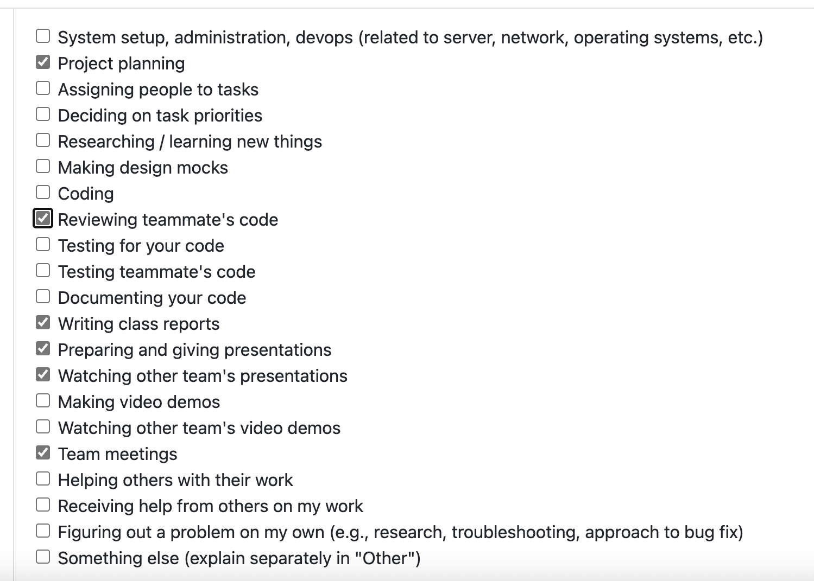

# Week 7 10/13 - 10/19

This week, I focused on reviewing and improving my previously written code. After receiving valuable feedback from the team that some parts of my code could be simplified and better documented, I took the time this week to refine my inline comments, write a comprehensive README explaining the class structure, and clean up and simplify the StatisticIndex class. In addition, I participated in our team meeting to discuss future work and priorities and spent time reviewing my teammates’ code to provide feedback.

# Week 6 10/06 - 10/12

This week the canonical requirements for the project were released. This meant our group had to revist our design documents to ensure they met the standard. I spent time whiteboarding and designing a new iteration of our system architure. Then, using the diagram as a basis, I started coding in the repo and made key classes in our system. This inculded a class to analyze a file, a report class, and a statistic class and creating the first tests for the project. I also created the developer enviorment for the group by defining a .devcontainer file. I also spent time reviewing other teammates' code (PR #21,#30).

# Week 5 09/29 - 10/05

This week our group need to complete the DFD diagram. Jimi completed the inital diagram and I provided feedback on that first draft. During class, I met with other teams and analyzed their DFD's and participated in group discussions about how we could improve our diagram. Lastly, because other group members helped with the editing of the DFD, I did independent research about metadata and our tech stack for future planning and coding.

# Week 4 09/22 - 09/28

This week, I focused heavily on developing the system architecture and refining the project proposal. We initially had a very basic architecture, but after seeing what other groups had created in class, we decided to go more in-depth. So, I created a new architecture incorporating aspects we observed during class. Additionally, I drafted many of the functional requirements and test cases for the project proposal and outlined the project scope, and usage scenarios.

# Week 3 09/15 - 09/21

For this week, the goal was figuring out a large, 5,000 foot, overview of what the project would look like and creating the requirements file. Specifically, I help create some non functional requirements and formulaize everyone's expectations of each other for the team contract.
