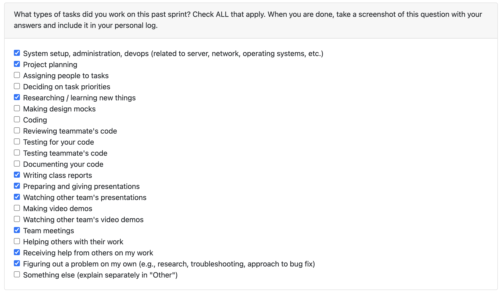

# Week 7 10/13 - 10/19

# Peer Evaluation!
[Peer Eval THN](./log_images/personal_log_imgs/tawana/tawana_week7_log.png)

# Recap on your week goals
This week, my focus was on organizing our documentation to support ongoing project tracking. I created a minutes/ directory, uploaded all past meeting notes, and took the notes for our October 16 session to maintain a consistent record of project progress. This centralizes our communication history and sets a clear structure for future documentation. In addition, I participated in our team meeting to discuss upcoming priorities and spent time reviewing my teammates’ code to provide feedback.

# Week 6 10/06 - 10/12

# Peer Evaluation!
[Peer Eval THN](./log_images/personal_log_imgs/tawana/tawana_week6_log.png)

# Recap on your week goals
This week, the main focus was on restructuring the documentation and aligning it with the updated Milestone #1 requirements. I contributed by preparing the team log, summarizing our progress, documenting the changes made to the system architecture and DFDs, and ensuring that our updated goals and deliverables were clearly reflected. This helped maintain consistency across the documentation branch and ensured that our work remained aligned with the revised direction.

# Week 5 09/29 - 10/05

# Peer Evaluation!
[Peer Eval THN](./log_images/personal_log_imgs/tawana/tawana_week5_log.png)

# Recap on your week goals
This week, the main focus was on creating the Level 0 and Level 1 DFD diagrams. I contributed by helping refine the Level 1 and Level 2 diagrams, identifying areas for improvement after presenting to other teams and reviewing their approaches for inspiration.

# Week 4 09/22 - 09/28

# Peer Evaluation!
[Peer Eval THN](./log_images/personal_log_imgs/tawana/tawana_week4_log.png)

# Recap on your week goals
This week, the main focus was on refining the system architecture diagram and completing the project proposal plan. I helped identify areas for improvement in our architecture diagram after meeting with other groups in the class. For the proposal, I created detailed use case diagrams for viewing the results dashboard and generating a static webpage with the option to host it on GitHub Pages.

# Week 3 09/15 - 09/21

# Peer Evaluation

# Recap on your week goals
For this week, our main focus was creating the document with the functional and non-functional requirements of the application. I contributed by helping refine the functional and non-functional requirements documents after meeting with other groups in class and comparing approaches. 