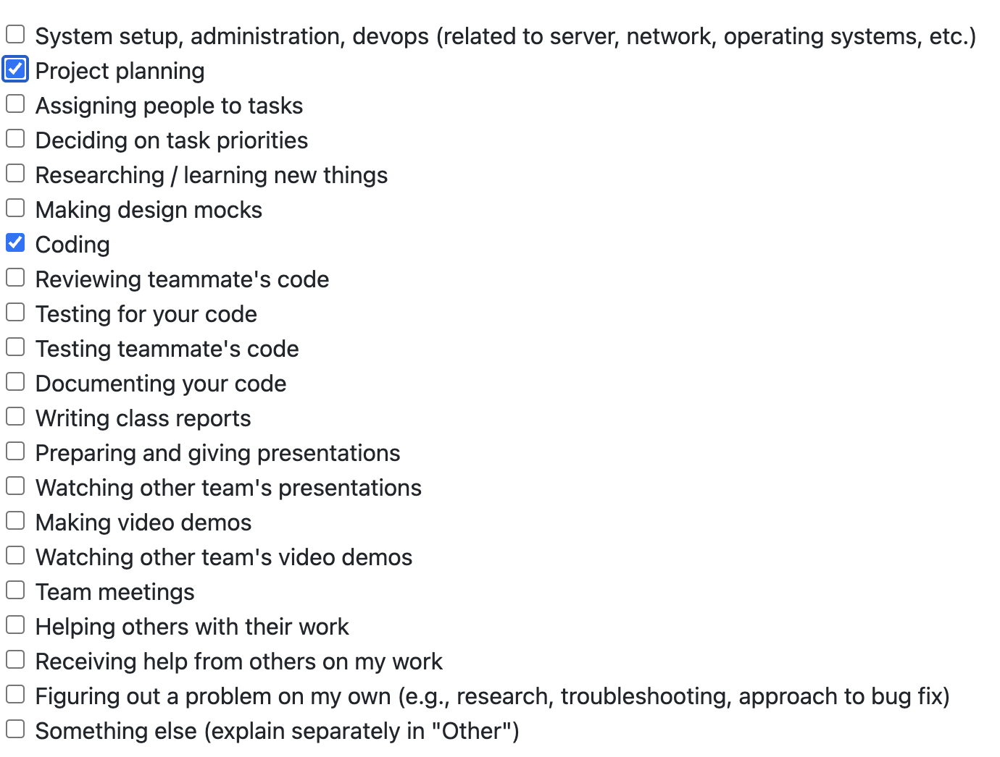
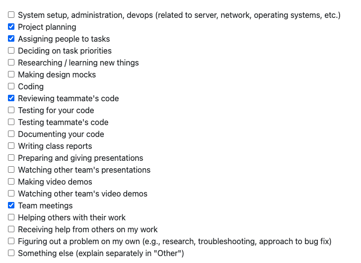
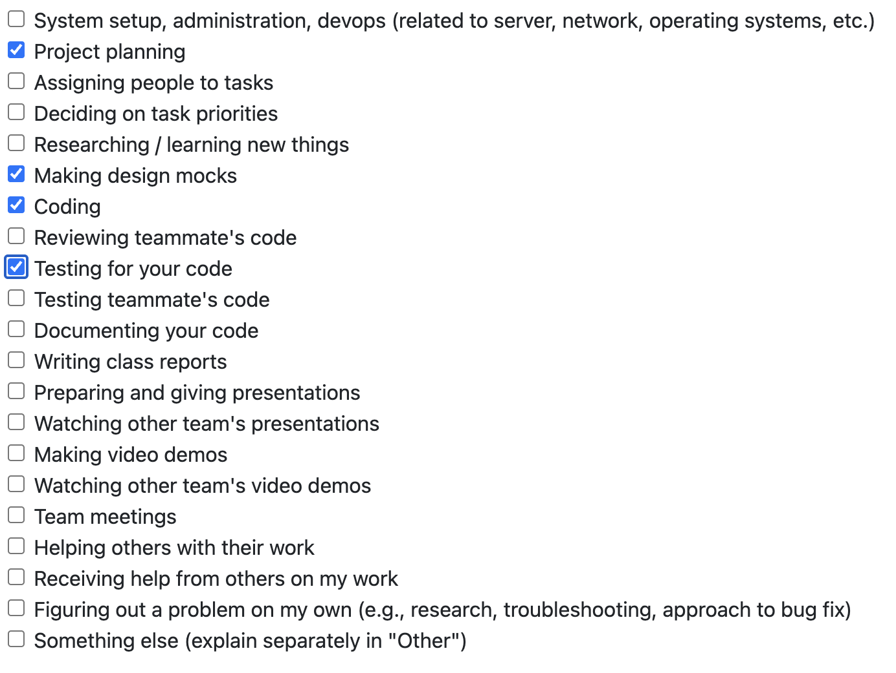
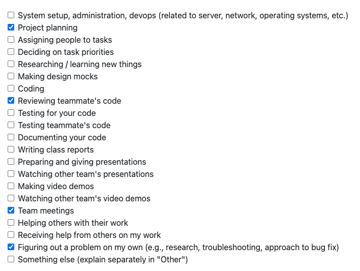

# Alex Taschuk Personal Logs Term 2

## Table of Contents

**[Week 1, Jan. 05 – 11](#week-1-jan-05--11)**

**[Week 2, Jan. 12 – 18](#week-2-jan-12--18)**

**[Week 3, Jan. 19 – 25](#week-3-jan-19--25)**

**[Week 4-5, Jan. 26 – Feb. 08]()
---

## Week 1, Jan. 05 – 11

### Peer Eval

### Recap

This week, I wrapped up the rest of the Alembic integration that I worked on over break. I still have not made a PR for the feature however because Sam's PRs have not been reviewed and merged yet. I also talked with the team about what our expectations are for the next milestone.

## Week 2, Jan. 12 – 18

### Peer Eval

### Recap

This week, I met with the team to refine what we need as a team to do for this milestone and what we need to do individually. I was assigned the team leader for the database side of our project, which means that I will be putting more focus towards the database for this milestone than others. Addtionally, I will be working on the frontend team to help design the frontend, and on the API migration team to help design, and implement an API, and migrate our current database towards one that uses a REST API.

I also created a couple of database-related issues that I will begin working on next week. One of them covers significant changes that need to be made for the database's structure and configuration, so it may take more than one week for its PR.

Lastly, I created a PR for the Alembic integration that I completed over winter break. The PR can be accessed [here](https://github.com/COSC-499-W2025/capstone-project-team-18/pull/356).

Here are the PRs that I reviewed this week:

- [#351 Decouple Start Miner Logic from the CLI and make Service Outline, Sam](https://github.com/COSC-499-W2025/capstone-project-team-18/pull/351#pullrequestreview-3675793062)
- [#355 Initialize API, Sam](https://github.com/COSC-499-W2025/capstone-project-team-18/pull/355)
- [#363 Error thrown by logging.py if not ran in the src directory, Jimi](https://github.com/COSC-499-W2025/capstone-project-team-18/pull/363)

## Week 3, Jan. 19 – 25

### Peer Eval

### Recap

I continued to work on the database config changes that are necessary for Milestone 2. The changes that are needed are very complicated, so I did not complete all of them in one week. I worked on adding some of the changes from [Issue 361](https://github.com/COSC-499-W2025/capstone-project-team-18/issues/361). I also worked on implementing some new tests for the changes. I will have a deeper explanation of these changes once I've completed them; I spent a lot of time having to figure out _how_ the database needs to change, so I will hopefully be implementing more of the changes in the next week or two.

## Week 4-5, Jan. 26 – Feb. 08

### Peer Eval

### Recap

The past two weeks have been very database-heavy for me. However, this past Wednesday, while working on the finishing touches for the database changes necessary for milestone two, the team and I decided that we should move away from a SQLAlchemy + Alembic implementation and towards one that uses SQLModel (a library that wraps SQLAlchemy and Pydantic together) + FastAPI. As a result, the PR that I was working on was closed. I spent some time discussing with Sam several architecture changes that are to be made to the database with the new implementation, and going over how the portfolio modification feature was going to be implemented.

I also spent time coming up with an approach to the `Resume` class system, since it needs a major overhaul due to the "user can modify resume" requirement. After coming up with a plan, I made a PR to propose my changes, since it wasn't necessaryily a discussing that required the entire team to be present, but I wanted a couple of people to review it and make sure that I'd covered all of the bases.

Next week, I plan to implement the proposed changes that I made.

Here is the PR I made for the proposed changes: [#418 [Proposal] New Resume Class System](https://github.com/COSC-499-W2025/capstone-project-team-18/pull/418)

Here are the PRs that I reviewed:

- [Portfolio Class System, Sam](https://github.com/COSC-499-W2025/capstone-project-team-18/pull/383)
- [Initialize Electron UI and FastAPI Integration, Tawana](https://github.com/COSC-499-W2025/capstone-project-team-18/pull/388)
- [408 fix down revision string, Jimi](https://github.com/COSC-499-W2025/capstone-project-team-18/pull/408)
- [412 New Database System, Sam](https://github.com/COSC-499-W2025/capstone-project-team-18/pull/412)
- [414 display textual information about a project, Priyansh](https://github.com/COSC-499-W2025/capstone-project-team-18/pull/414)
- [419 [perf] Speed-up file reports analysis, Jimi](https://github.com/COSC-499-W2025/capstone-project-team-18/pull/419)

