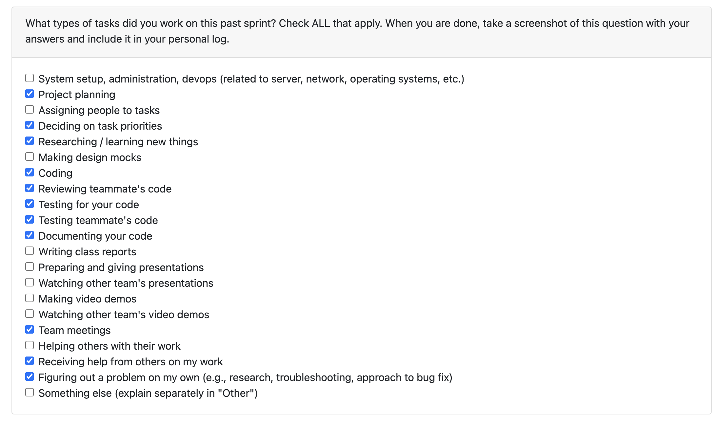
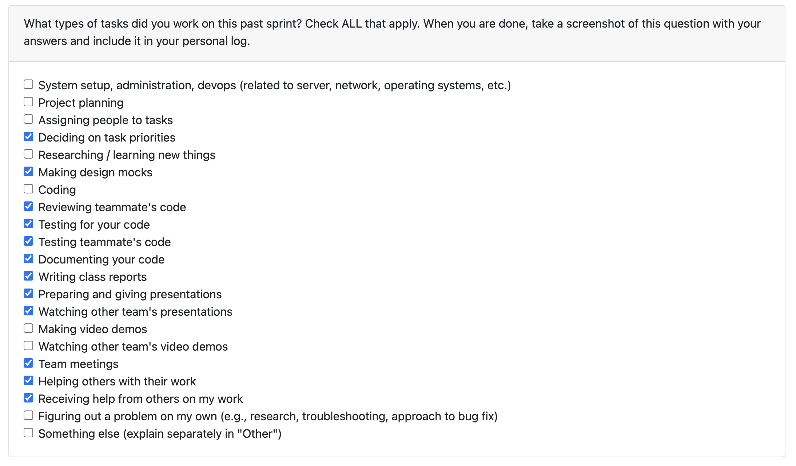

# Erem Ozdemir Personal Logs Term 2

## Table of Contents

**[T2 Week 10, Mar 9 - Mar 15](#t2-week-10-mar-9--mar-15)**

**[T2 Week 9, Mar 2 - Mar 8](#t2-week-9-mar-2--mar-8)**

**[T2 Week 8, Feb 9](#t2-week-8-feb-23--mar-1)**

**[T2 Week 4-5, Jan 26 - Feb 8](#t2-week-4/5-jan-26--feb-8)**

**[T2 Week 3, Jan 19 - 25](#t2-week-3-jan-19--jan-25)**

**[T2 Week 2, Jan 12 - 18](#t2-week-2-jan-12--jan-18)**

**[Week 1, Jan 05 - 11](#week-1-jan-05---11)**

---

## T2 Week 10, Mar 9 - Mar 15

### Peer Eval

### Recap

This week I completed and finalized [PR #484 - Add education and awards to user config and resume generation](https://github.com/COSC-499-W2025/capstone-project-team-18/pull/484), closing [Issue #467](https://github.com/COSC-499-W2025/capstone-project-team-18/issues/467).

Since last week the design of the feature went through architectural change following code review feedback from Sam. Originally, I had implemented education and awards as a snapshot on `ResumeModel`, the idea being that generating a resume would capture the user's education and awards at that point in time, so editing the user config later wouldn't retroactively change old resumes. Sam noted that it would make more sense for every resume retrieval to reflect the current `ResumeConfig` state, keeping things consistent across all resumes rather than having each one diverge over time.

As a result I removed the `education` and `awards` columns from `ResumeModel` entirely and instead introduced a `_build_resume_response()` helper in the resume router that hydrates education and awards from the user's current `ResumeConfigModel` at read time. This affected every endpoint that returns a `ResumeResponse` - `GET /resume/{id}`, `POST /resume/generate`, `POST /resume/{id}/refresh`, `POST /resume/{id}/edit/metadata`, `POST /resume/{id}/edit/bullet_point`, and `POST /resume/{id}/edit/resume_item`, all now go through this helper.

With the PR now addressing all review feedback, the feature is just currently under review right now.

#### Reviewing Tasks

I reviewed [PR #485 - Get Group Based Statistics](https://github.com/COSC-499-W2025/capstone-project-team-18/pull/485) by Jimi, which adds group contribution statistics to the project. The PR introduces `ACTIVITY_TYPE_RATIO`, `GROUP_CONTRIBUTION`, and `GROUP_SKILLS` statistics computed within the statistic classes, laying the groundwork for group-level API endpoints in a follow-up PR.

## T2 Week 9, Mar 2 - Mar 8

### Peer Eval

### Recap

This week I focused on completing the education and awards feature for user configuration and resume generation, which is part of Milestone 3's enhanced resume customization requirements.

#### Coding Tasks

I implemented and am finalizing [PR #467 - Add education and awards to user config and resume generation](https://github.com/COSC-499-W2025/capstone-project-team-18/issues/467). The feature extends `UserConfigModel` with `education` and `awards` fields (stored as JSON arrays in SQLite), updates the `GET /user-config` and `PUT /user-config` endpoints to expose these fields, and plumbs them through the resume generation pipeline so `UserReport.generate_resume()` accepts and includes education/awards in the output.

The feature is ~95% complete, all code is written and endpoints are working in Swagger UI. The remaining work is fixing a database initialization issue where `SQLModel.metadata.create_all()` isn't being triggered on server startup, causing "no such table" errors on fresh deploys. Once that's resolved, the feature will be ready for final testing and merge.

#### Reviewing Tasks

Due to a few reasons including personally being swamped with work with other classes, as well as it being the first week of M3 + Quiz 4 meaning there hasnt been too much development with the project for this group, I haven't been able to review any of my teammates PR's unfortunately.

#### Goals for Next Week

- Resolve the database initialization issue and get PR #467 merged
- Add integration tests for the education/awards endpoints
- Begin work on the next Milestone 3 feature (authentication or advanced resume customization)

## T2 Week 8, Feb 23 - Mar 1

### Peer Eval

### Recap

This week the team focused on completing Milestone 2 requirements. My work centred on shipping the remaining API endpoints - project upload, privacy consent, and the full resume management suite — as well as fixing a performance regression in the ML contribution analysis pipeline.

#### Coding Tasks

I implemented and merged [PR #437 - POST /projects/upload & POST /privacy-consent endpoints](https://github.com/COSC-499-W2025/capstone-project-team-18/pull/437), closing [Issue #410](https://github.com/COSC-499-W2025/capstone-project-team-18/issues/410). `POST /projects/upload` accepts a zipped project file (`.zip`, `.7z`, `.tar.gz`, `.gz`), reads it as bytes, and passes it into `start_miner_service` along with a `UserConfig` built from optional query params. The miner handles project discovery, file analysis, and saving results to the database. `POST /privacy-consent` lets the frontend record whether the user has agreed to data collection — it fetches the existing `UserConfigModel` and updates it in place, returning the saved consent state, email, and GitHub username so the client can confirm what was stored. Both endpoints include full test coverage and proper error handling (400, 422, 500).

I also implemented and merged [PR #429 - Resume API Endpoints](https://github.com/COSC-799-W2025/capstone-project-team-18/pull/429), closing [Issue #416](https://github.com/COSC-499-W2025/capstone-project-team-18/issues/416). This adds three endpoints for resume management: `GET /resume/{id}` retrieves a stored resume by ID, `POST /resume/generate` runs the full `UserReport.generate_resume()` pipeline from a list of project names and saves the result, and `POST /resume/{id}/edit` updates metadata on an existing resume. Key fixes included date serialization (using `date` type instead of `str` in response models), removing problematic `session.delete()` and `session.refresh()` calls that broke with mocked objects, and extracting a reusable `get_user_config_safe()` helper into `user_config.py` following a PR review suggestion from Sam.

Additionally I investigated and fixed a performance issue where the ML contribution analysis pipeline (`ProjectContributionPatterns`) was extremly slow loading the original `facebook/bart-large-mnli` locally, and thus we switched it over to Azure OpenAI similar to the configuration of the other ML analysis

#### Reviewing Tasks

I reviewed [PR #444 - Display Textual Information About A Project As A Resume Item](https://github.com/COSC-499-W2025/capstone-project-team-18/pull/444) by Jimi, which adds natural language project descriptions as resume bullet points derived from project analysis.

I reviewed [PR #443 - Week 8 Log](https://github.com/COSC-499-W2025/capstone-project-team-18/pull/443) by Priyansh.

I reviewed [PR #442 - Extra Documentation for Endpoints](https://github.com/COSC-499-W2025/capstone-project-team-18/pull/442) by Sam, which adds clear documentation for all current development endpoints.

I reviewed [PR #438 - Fix FILE_HASH merge conflicts](https://github.com/COSC-499-W2025/capstone-project-team-18/pull/438) by Jimi.

#### Goals for Next Week

- Start working on Milestone 3
- Look into authentication for the API endpoints

## T2 Week 4-5, Jan 19 - 25

### Peer Eval

### Recap
Over the last two weeks I focused on shipping new API endpoints and reviewing the team’s database refactor.

I implemented and merged PR [#409](https://github.com/COSC-499-W2025/capstone-project-team-18/pull/409), adding REST endpoints GET /projects and GET /projects/{id} to retrieve project data from the database. This included Pydantic response models, service-layer retrieval logic, automatic stats deserialization in responses, and full test coverage (empty DB, single/multiple projects, 404s, invalid IDs, and response validation).

I’m also finishing issue [#416](https://github.com/COSC-499-W2025/capstone-project-team-18/issues/416) (~90% done), adding resume endpoints: GET /resume/{id}, POST /resume/generate, and POST /resume/{id}/edit. The work follows the new DB architecture from Sam’s PR [#412 new database system](https://github.com/COSC-499-W2025/capstone-project-team-18/pull/412), with CRUD in src/database/api/CRUD/resume.py, routing in src/interface/api/routers/resume.py, request validation models, and integration with UserReport.generate_resume(). The endpoints are working in Swagger UI with test project.

On reviews, I looked over major PRs including Sam’s [#412 new database system](https://github.com/COSC-499-W2025/capstone-project-team-18/pull/412) and [#397 test optimizations](https://github.com/COSC-499-W2025/capstone-project-team-18/pull/397), Priyansh’s [#414 ML project display](https://github.com/COSC-499-W2025/capstone-project-team-18/pull/414) , and Jimi’s [#417 LaTeX-to-PDF export](https://github.com/COSC-499-W2025/capstone-project-team-18/pull/417)

## T2 Week 3, Jan 19 - 25

### Peer Eval

### Recap
This week was mainly about closing out and landing my ML contribution analysis work, plus reviewing teammate PRs. I finished up and merged PR [#360: ML-based contribution pattern analysis for commit classification, work patterns, and collaboration roles](https://github.com/COSC-499-W2025/capstone-project-team-18/pull/381) which adds ML-based contribution pattern analysis at the ProjectReport level, and delievers on part of Milestone #2 requirement #25	"Incorporate evidence of success (e.g., metrics, feedback, evaluation) for a given project".

The feature classifies commit messages using BART zero-shot (bart-large-mnli) into commit types, clusters commit timing with DBSCAN to label work cadence patterns (consistent, burst, sprint-based, sporadic), and infers a collaboration role (leader, core contributor, specialist, occasional, solo) based on contribution share, team size, and commit mix. I also made sure the implementation behaves well in real usage by lazy-loading and caching models, degrading cleanly to heuristics when ML is disabled or unavailable, and tightening up ProjectReport initialization order (calling super().__init__() before building stats). Alongside the feature work, I added unit tests for each analyzer and integration coverage for end-to-end statistics generation, and updated dependencies needed for transformers and scikit-learn.

On the review side, I reviewed Sam’s PR [Robust start_miner_service #378](https://github.com/COSC-499-W2025/capstone-project-team-18/pull/378) and reviewed Priyansh’s work [Improve README insights stability and CLI output formatting and adding docstrings #380](https://github.com/COSC-499-W2025/capstone-project-team-18/pull/380).

## T2 Week 2, Jan 12 - 18

### Peer Eval

### Recap
This week I was mostly focused on pushing the ML contribution analysis feature close to the finish line and reviewing teammate PRs. I reviewed Priyansh’s ML work for README keyphrase extraction and auto-tagging in PR #359. On the implementation side, I brought PR #360-b (ML Contribution Pattern Analysis) to about 90% completion. I added commit message classification using a BART zero-shot approach with a keyword fallback, built a pattern analyzer to detect work styles (consistent, sprint-based, sporadic, late-stage), and implemented collaboration role inference (leader, core contributor, specialist, occasional). I then wired the ML outputs into the existing project statistics pipeline, added resume bullet generation based on contribution patterns, and updated the portfolio CLI output to display work patterns and commit type distributions. The main remaining work is bug fixes and testing.

On the technical side, I added transformers and torch dependencies, introduced lazy model initialization to keep performance reasonable, and kept the implementation aligned with the existing statistics calculation and reporting patterns used across the codebase.
>>>>>>> c2759da (Erem T2 Week 2 logs):logs/Erem.md

## Week 1, Jan 05 - 11

### Peer Eval

### Recap
After the break, we met as a team to get back on the same page after the end of Milestone 1. We went through what was finished and what still needed cleanup. I also talked with the TA to confirm the expectations and rubric details so we are not assuming anything.

I also reviewed Sam’s PR #332 (Refactor Test Directory) as well. It improved how the tests are organized and makes the suite much easier to maintain as it grows.

Overall, the week was mostly Milestone 1 cleanup plus making sure we understand the requirements.