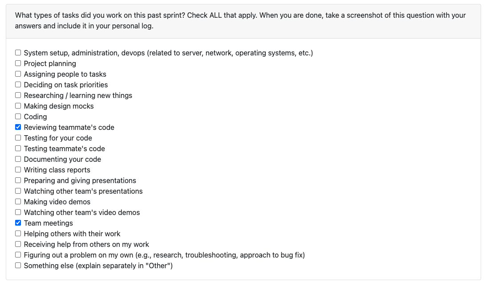

# Erem Ozdemir Personal Logs Term 2

## Table of Contents

**[T2 Week 2, Jan 12 - 18](#t2-week-2-jan-12--jan-18)**

**[Week 1, Jan 05 - 11](#week-1-jan-05---11)**

---

## T2 Week 2, Jan 12 - 18

### Peer Eval

### Recap
This week I was mostly focused on pushing the ML contribution analysis feature close to the finish line and reviewing teammate PRs. I reviewed Priyansh’s ML work for README keyphrase extraction and auto-tagging in PR #359. On the implementation side, I brought PR #360 (ML Contribution Pattern Analysis) to about 90% completion. I added commit message classification using a BART zero-shot approach with a keyword fallback, built a pattern analyzer to detect work styles (consistent, sprint-based, sporadic, late-stage), and implemented collaboration role inference (leader, core contributor, specialist, occasional). I then wired the ML outputs into the existing project statistics pipeline, added resume bullet generation based on contribution patterns, and updated the portfolio CLI output to display work patterns and commit type distributions. The main remaining work is bug fixes and testing.

On the technical side, I added transformers and torch dependencies, introduced lazy model initialization to keep performance reasonable, and kept the implementation aligned with the existing statistics calculation and reporting patterns used across the codebase.
>>>>>>> c2759da (Erem T2 Week 2 logs):logs/Erem.md

## Week 1, Jan 05 - 11

### Peer Eval

### Recap
After the break, we met as a team to get back on the same page after the end of Milestone 1. We went through what was finished and what still needed cleanup. I also talked with the TA to confirm the expectations and rubric details so we are not assuming anything.

I also reviewed Sam’s PR #332 (Refactor Test Directory) as well. It improved how the tests are organized and makes the suite much easier to maintain as it grows.

Overall, the week was mostly Milestone 1 cleanup plus making sure we understand the requirements.