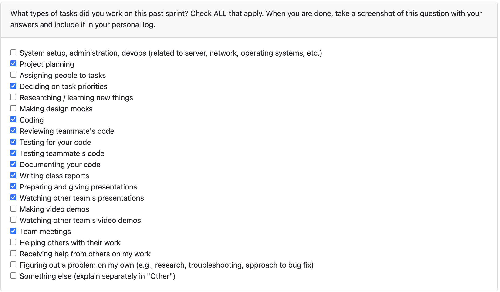
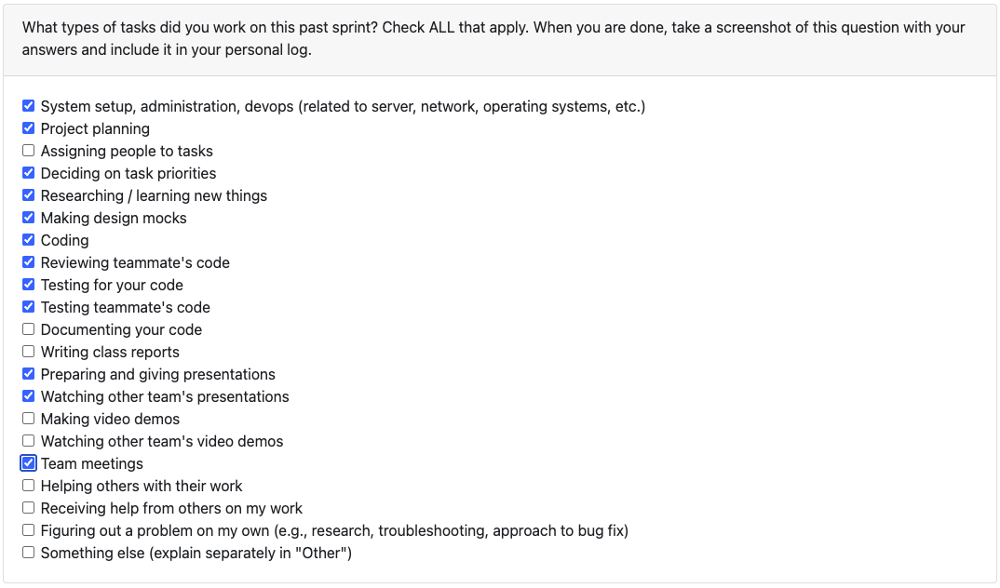
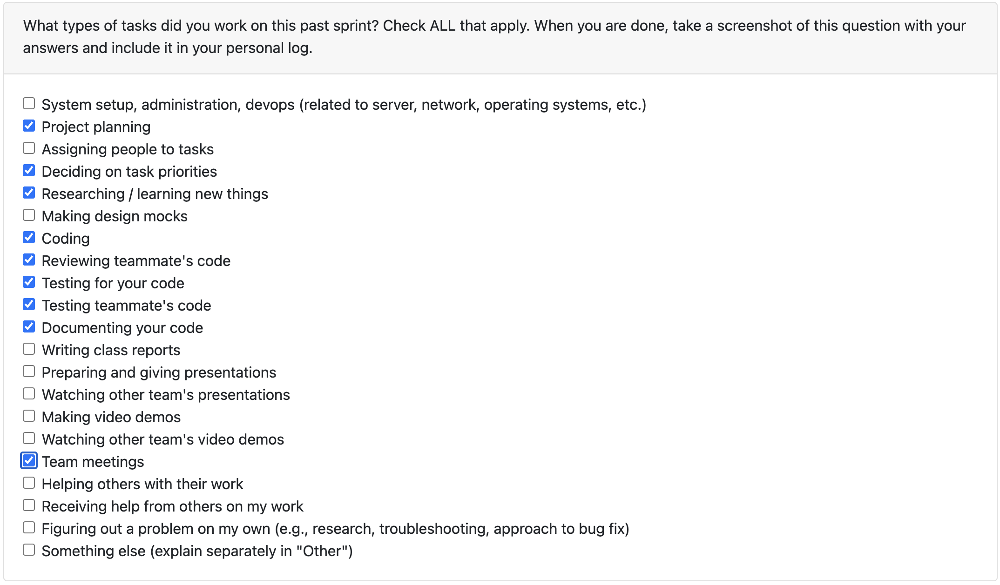

# Jimi Ademola Personal Logs Term 2

## Table of Contents

**[Week 8, Feb, 24 - Mar 01](#week-8-feb-24---mar-01)**
**[Week 5, Feb, 02 - 08](#week-4-feb-02---08)**
**[Week 3, Jan. 19 - 25](#week-3-jan-19---25)**
**[Week 2, Jan. 12 - 18](#week-2-jan-12---18)**
**[Week 1, Jan. 05 - 11](#week-1-jan-05---11)**

---

## Week 8, Feb, 24 - Mar 01

### Peer Eval

### Recap

Last week, we were focused on integrating all functionality from API service calls. In addition to this we needed to implement additional requirements defined for Milestone 2.

### This Week

This week we met to finalize all requirements for the milestone. This meant cleaning up the repository, working on the front-end, presentation and the video demo. Additoinally, we worked to ensure we covered all necessary API endpoints for our project.

### Coding Tasks
Personally, I was working on dealing with checking against duplicated files and adding incremental information to portfolio / reports. This was finalized but due to the lasting nature of the PR, was shifted to a new branch to resolve conflicts and can be found at [COSC-499-W2025/capstone-project-team-18#362](https://github.com/COSC-499-W2025/capstone-project-team-18/issues/362). Secondly, I worked on an additional requirement which was to allow for incremental changes given a file uploaded at a future time. This was done by adding a parent object to ProjectReports and measuring the changes in statistcs between points in analysis.

### Testing Tasks
Testing tasks for this week can be found in all above PRs. The hashing was tested to ensure they matched correctly, teh database flow was as expected and that the salting of user's hash was of impact. The incremental file changes was tested to ensure each inccrement had teh correct parent refernce, with statsitics outputting as expected. We needed to ensure both that the DB changes were relevant and the reuslitng output was sensical. Additionally, the continued passing of all tests displays no breaking changes or corrupted data.

### Reviewing Tasks
This week I reviewed:
- [Proposal] New Resume Class System [410](https://github.com/COSC-499-W2025/capstone-project-team-18/pull/437)
- New Database System [#412](https://github.com/COSC-499-W2025/capstone-project-team-18/pull/430)

### Next Week
Next week, we will be working on cleaning up the codebase, testing the remaining code and expanding endpoints. Further more, the frontend needs to be fleshed out to better serve a non-technical userbase.

## Week 5, Feb, 02 - 08

### Peer Eval

### Recap

Last week, we were focused on integrating all functionality from API service calls. In addition to this we needed to implement additional requirements defined for Milestone 2.

### This Week

This week we met to set out tasks for the week. Unfortunately, the alembic migration was having cascading issues, affecting multiple branches and was not efficient for developer or application. Because of this we moved towards using SQLModel for our database. This meant many PRs that were in progress had to be refactored to take into account the new model.

### Coding Tasks
Personally, I was working on dealing with checking against duplicated files and adding incremental information to portfolio / reports. This was mainly done, but halted due to DB changes and may or may not be done by week-end. To still complete some tasks, I refocused. This meant working on some performance upgrades such as parallelizing the file analysis seen in [#75](https://github.com/COSC-499-W2025/capstone-project-team-18/issues/75). This provided a near 3x speed-up in analysis. Additionally, I worked on implementing the LaTeX to PDF feature for users to have have more than a `.tex` output. This renders the generated resume into a usable pdf. This is found in [#417](https://github.com/COSC-499-W2025/capstone-project-team-18/pull/417) Lastly, I worked on logic for dealing with uncontributed files that have affects on our ML-based semantic analysis. this can be seen in [#391](https://github.com/COSC-499-W2025/capstone-project-team-18/pull/391). In progress, is [#420](https://github.com/COSC-499-W2025/capstone-project-team-18/pull/420) which will deal with file duplication by adding a hash of file contents.

### Testing Tasks
Testing tasks for this week can be found in all above PRs. The parallelization was tested to ensure there was a speed-up and this wasn't any waste of resources. Additionally, the continued passing of all tests displays no data race or corrupted data. LaTeX to PDF was tested by ensuring a correct pdf based output and a normalized filepath. The info files were also tested to ensure, they are only created and flagged in the case of files without contribution.

### Reviewing Tasks
This week I reviewed:
- [Proposal] New Resume Class System [418](https://github.com/COSC-499-W2025/capstone-project-team-18/pull/418)
- New Database System [#412](https://github.com/COSC-499-W2025/capstone-project-team-18/pull/412)
- ml analysis for user summary [#411](https://github.com/COSC-499-W2025/capstone-project-team-18/pull/411)
- Add GET endpoints [#409](https://github.com/COSC-499-W2025/capstone-project-team-18/pull/409)
- Improve readme theme extraction [#401](https://github.com/COSC-499-W2025/capstone-project-team-18/pull/401)
- Initialize Electron UI and FastAPI [#388](https://github.com/COSC-499-W2025/capstone-project-team-18/pull/388)
- Portfolio Class System [#383](https://github.com/COSC-499-W2025/capstone-project-team-18/pull/383)

### Next Week
Next week, we will be finalizing all API endpoints, fleshing out the UI to have a cleaner user flow and working on the remaining Milestone 2 requirements. These include incremental project information and more user customizability within resumes and portfolios.

## Week 3, Jan. 19 - 25

### Peer Eval

### Recap

Last week we worked on the frontend connection which included API integration, a new Portfolio class system, API integration and improvements on service includes ML analysis and other key requirements.

### This Week

This week we first met to create varying teams such as ML, system analysis, database & frontend. With each person leading a single group and also being a part of many, there was proper division of the work. No major issues in terms of development or progress were encountered this week.

### Coding Tasks

I focused on resolving some fixes and adding some key requirements. This included adjusting the behavior for files which are not contributed to and can be found in [#391](https://github.com/COSC-499-W2025/capstone-project-team-18/pull/391).
The second feature was a key requirement to recognize and not reanalyze duplicate files. This was resolved using a `MD5` hash value and a database check. This is found at [#393](https://github.com/COSC-499-W2025/capstone-project-team-18/pull/393)

### Testing Tasks

Tests were added and debugged primarily for the last feature in PR **#393**. This was as multiple tests had to be added to ensure correct access to the database, proper table creation with the additional row and ensure duplicates were checked across many edge cases (uncontributed files etc...).  Beyond that, tests were done and reviewed for the `INFO_FILES` change in **#391**, which simply checked that fileReports were being generated correctly and prior functionality was unaffected.

### Reviewing Tasks

I reviewed [#380](https://github.com/COSC-499-W2025/capstone-project-team-18/pull/388) which was changes needed improve on the ML insights on project tone and themes done by Priyansh. I additionally reviewed [#388](https://github.com/COSC-499-W2025/capstone-project-team-18/pull/356) which was the initialization of the Electron-based UI and integration with the current FastAPI setup.

### Next Week
Next week will further connect the frontend and backend by allowing for near-complete integration utilizing API calls. Additionally, the UI will be customized to further include more customization and the varying required pages.

## Week 2, Jan. 12 - 18

### Peer Eval

### Recap

This week we met as a group to discuss all Milestone 1 requirements and ensure they were correctly met. Additionally I reviewed multiple PRs, including [#321](https://github.com/COSC-499-W2025/capstone-project-team-18/pull/321) and [#327](https://github.com/COSC-499-W2025/capstone-project-team-18/pull/327) which were refactoring changes made to simplify the project for future changes.

## Week 2, Jan. 12 - 18

### Peer Eval

### Recap

Last week we met as a group to prepare for Milestone 2 and figure out which requirements were currently missing.

### This Week

This week we first met to create varying teams such as ML, system analysis, database & frontend. With each person leading a single group and also being a part of many, there was proper division of the work. No major issues in terms of development or progress were encountered this week.

### Coding Tasks

I focused on resolving some bugs that had been found in the code. This included finally fixing the contribution percentage error, which was caused by line counts being tracked in junk files and can be found in [#358](https://github.com/COSC-499-W2025/capstone-project-team-18/pull/358).
The second bug fix was an error thrown in the CLI due to the logging files. This was resolved and a `constants.py` file was created for future reference. This is found at [#357](https://github.com/COSC-499-W2025/capstone-project-team-18/pull/357)
Lastly, I added a secondary check for all contribution and commit-style metrics using a GitHub account check. This adds all back-end logic and additionally updates the information displayed in the _LaTeX_ resume. Found in [#368](https://github.com/COSC-499-W2025/capstone-project-team-18/pull/368).

### Testing Tasks

Tests were added and debugged primarily for the last feature in PR **#368**. This was as multiple tests had to be reconfigured to have an additional parameter, while new tests additionally had to be created to ensure functionality. Functional tests were added to ensure the total contribution bug in Issue [#296](https://github.com/COSC-499-W2025/capstone-project-team-18/issues/296) did not reoccur pending changes. Beyond that, tests were done and reviewed for the alembic database changes.

### Reviewing Tasks

I reviewed [#351](https://github.com/COSC-499-W2025/capstone-project-team-18/pull/351) which was changes needed to move away from a CLI interface towards a full frontend and such also included API services placeholders. I additionally reviewed [#356](https://github.com/COSC-499-W2025/capstone-project-team-18/pull/356) which was the Alembic database functionality which added migration features / version control to the DB. This then inspired the need for `constants.py` to avoid hard-coded file paths.

### Next Week

Next week will bring the first stages of the frontend and 'inference' from the newly computed insights in the ML models. Additionally, we will need to integrate the API to tie together the current analysis with the ability for the user to fetch information whether through a direct API call or a User Interface.

## Week 1, Jan. 05 - 11

### Peer Eval

### Recap

This week we met as a group to discuss all Milestone 1 requirements and ensure they were correctly met. Additionally I reviewed multiple PRs, including [#321](https://github.com/COSC-499-W2025/capstone-project-team-18/pull/321) and [#327](https://github.com/COSC-499-W2025/capstone-project-team-18/pull/327) which were refactoring changes made to simplify the project for future changes.

