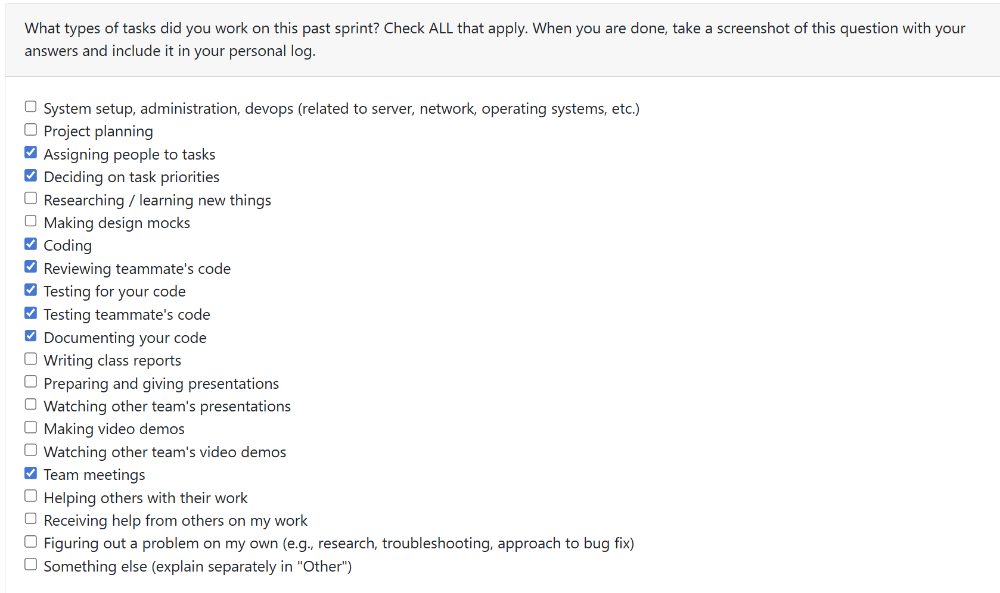
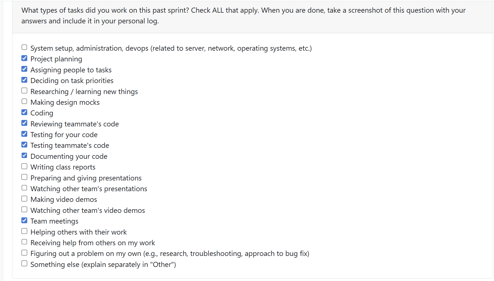
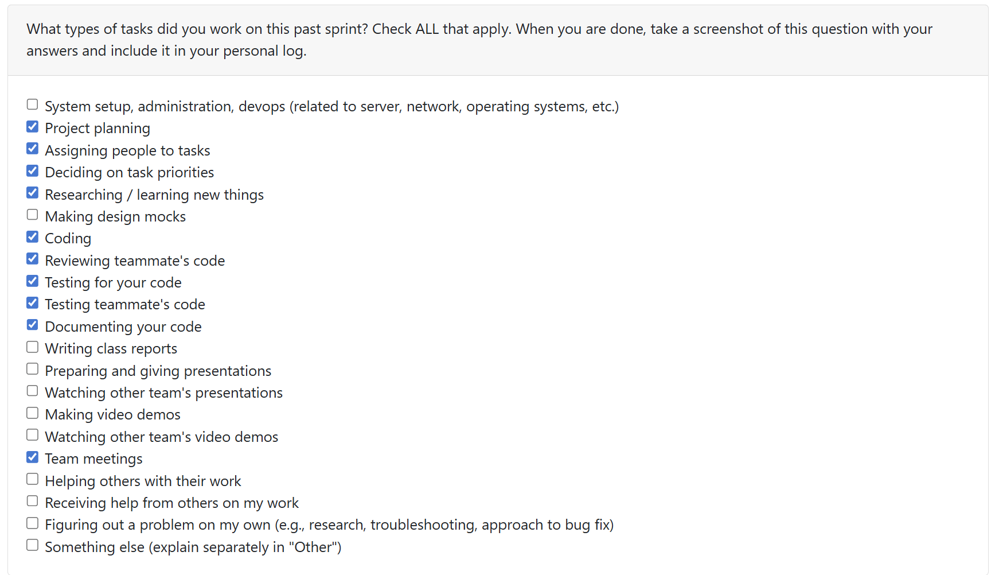
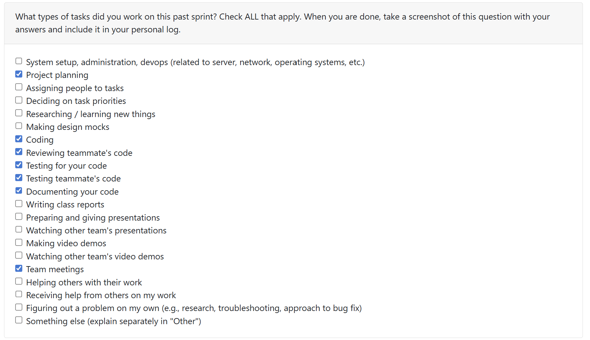
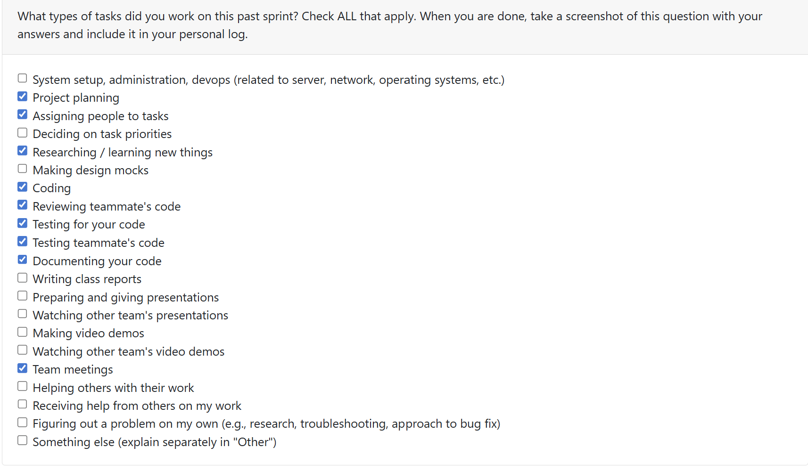

2# Priyansh Mathur Personal Logs Term 2

## Table of Contents

**[Week 1, Jan. 05-11](#week-1-jan-05-11)**

**[Week 2, Jan. 12-18](#week-2-jan-12-18)**

**[Week 3, Jan. 19-25](#week-3-jan-19-25)**

**[Week 4-5, Jan. 26-Feb. 08](#week-4-5-jan-26-feb-08)**

**[Week 8, Feb. 22-Mar. 01](#week-6-feb-23-mar-01)**

**[Week 9, Mar. 02-08](#week-9-mar-02-08)**

---

## Week 1, Jan. 05-11

### Peer Eval

### Recap
This week, our team reconvened after the break to reassess where we stood with Milestone 1. We discussed our individual progress, highlighted areas that needed improvement, and confirmed the remaining tasks required to complete the milestone. We have also started planning and discussing Milestone 2 requirments. Additionally I reviewed PR #341 Tawana Term 2 Week 1 Personal Log and PR #322 Refactor Test Directory by Sam

## Week 2, Jan. 12-18

### Peer Eval

### Recap

Building on the planning and coordination from Week 1, this week focused on divison of teams to handle tasks for Milestone 2.

#### Coding Tasks

I completed [PR #364 - Extract README Key Phrases to Auto‑Tag Projects](https://github.com/COSC-499-W2025/capstone-project-team-18/pull/364), which closes [Issue #359](https://github.com/COSC-499-W2025/capstone-project-team-18/issues/359). This PR implements sophisticated README analysis using three ML models:

- **KeyBERT** for extracting key phrases and technical tags from README content
- **BERTopic** for discovering project themes through topic modeling across multiple README files
- **BART-MNLI** for zero-shot tone classification (technical, casual, educational, promotional)

The implementation aggregates README insights at the project level and surfaces them in portfolio output. I created comprehensive docstrings for all functions, implemented error handling for BERTopic edge cases (e.g., zero-size arrays when insufficient documents exist)

#### Reviewing Tasks

I reviewed two critical PRs this week:

1. [PR #356 - Implement DB Migration & Version Control via Alembic](https://github.com/COSC-499-W2025/capstone-project-team-18/pull/356) by Alex

2. [PR #358 - Fix Contribution Percentage Bug](https://github.com/COSC-499-W2025/capstone-project-team-18/pull/358) by Sam

#### Goals for Next Week
- Continue work on Milestone 2 features, involving additional ML support and analysis
- Support the team with any Milestone 1 deliverables and documentation

## Week 3, Jan. 19-25

### Peer Eval

### Recap
This Week the team focused on buliding a base template for the frontend UI, creating meaningful API which will service the backend to the frontend, improved ML analysis on README files and contribution analysis on ProjectReport, and Alembic DB related fixes.

#### Coding Tasks
I completed [PR #380 - Improve README insights stability and CLI output formatting and adding docstrings](https://github.com/COSC-499-W2025/capstone-project-team-18/pull/380), which closes [Issue #379](https://github.com/COSC-499-W2025/capstone-project-team-18/issues/379).

This PR adds a safer README insights flow so themes/tone don’t disappear when BERTopic fails, filters URL/noise terms, and trims long tag/theme lists for readability. It also silences ML/log spam in the CLI and clears old logs on startup. This fixes the issue where some projects showed no themes/tone and where CLI output was overly noisy.

#### Reviewing Tasks
1. [PR #377 - Alembic hotfix, created initial revision file for the database](https://github.com/COSC-499-W2025/capstone-project-team-18/pull/377) by Alex

2. [PR #381 - ML-based contribution pattern analysis for commit classification, work patterns, and collaboration roles ](https://github.com/COSC-499-W2025/capstone-project-team-18/pull/381) by Erem

My feedback focused on code correctness, test coverage, and edge case handling.

#### Goals for Next Week
- Understanding how ML Analysis can be further implemented in our system
- Buliding Frontend UI

## Week 4-5, Jan. 26-Feb. 08

### Peer Eval

### Recap
These two weeks were focused on enhancing ML-based analysis capabilities, particularly improving README theme extraction and implementing comprehensive project summary generation for portfolio output. The team also made significant progress on frontend UI development with Electron, API endpoints, and system optimization.

#### Coding Tasks

1. I completed [PR #401 - Improve README Theme Extraction](https://github.com/COSC-499-W2025/capstone-project-team-18/pull/401), which closes [Issue #399](https://github.com/COSC-499-W2025/capstone-project-team-18/issues/399). This PR significantly improves theme extraction quality by adding programming languages to the filter list to prevent generic terms from appearing as themes, while allowing short acronym themes like "ML", "API", and "CI/CD". The improvements result in cleaner, more meaningful theme tags for projects in portfolio output.

2. I completed [PR #414 - Display Textual Information About a Project](https://github.com/COSC-499-W2025/capstone-project-team-18/pull/414), which closes [Issue #406](https://github.com/COSC-499-W2025/capstone-project-team-18/issues/406). This PR introduces ML-generated project summaries that add concise, professional 2–3 sentence descriptions to each portfolio project, covering project goals, technologies used, and the user's contribution. The implementation includes a robust deterministic fallback system when ML generation is unavailable, lazy-loading for ML dependencies to prevent import-time crashes, regex-based sentence splitting, and normalized contribution statistics.

3. Additionally, I completed [PR #411 - ML Analysis for User Summary](https://github.com/COSC-499-W2025/capstone-project-team-18/pull/411), which closes [Issue #402](https://github.com/COSC-499-W2025/capstone-project-team-18/issues/402). This PR implements ML-generated user summaries for portfolio output, producing professional, personalized summaries that adapt to each user's profile (focus, role, work style, and experience stage). The implementation includes per-project summary generation, improved resume summaries highlighting user skills and work patterns, enhanced text processing with regex-based sentence splitting, optimized keyword mappings for domain detection, and comprehensive documentation.

#### Reviewing Tasks

1. [PR #389 - Tawana Term 2 Week 3 Personal Log](https://github.com/COSC-499-W2025/capstone-project-team-18/pull/389) by Tawana
2. [PR #391 - Store Files that Have Not Been Contributed to as INFO_FILES](https://github.com/COSC-499-W2025/capstone-project-team-18/pull/391) by Jimi
3. [PR #397 - Optimize Tests](https://github.com/COSC-499-W2025/capstone-project-team-18/pull/397) by Sam
4. [PR #412 - New Database System](https://github.com/COSC-499-W2025/capstone-project-team-18/pull/412) by Sam
5. [PR #418 - [Proposal] New Resume Class System](https://github.com/COSC-499-W2025/capstone-project-team-18/pull/418) by Alex

My reviews focused on ensuring code quality, proper error handling, test coverage, and alignment with our system architecture.

#### Goals for Next Week

- Work on remaining Milestone 2 deliverables and documentation

## Week 8, Feb. 23-Mar. 01

### Peer Eval

### Recap

This week the team focused on completing Milestone 2 requirements. Major work included infrastructure upgrades to the ML generation pipeline, implementing portfolio persistence and CRUD operations, developing new API endpoints for skills extraction and user configuration, and improving documentation across the codebase. On the frontend, significant progress was made building out the Electron desktop application with new pages for projects and skills visualization, along with FastAPI integration for seamless backend communication.

#### Coding Tasks

I completed [PR #440 - Upgrade ML Generation Pipeline to Azure OpenAI for Portfolio Outputs](https://github.com/COSC-499-W2025/capstone-project-team-18/pull/440), which closes [Issue #439](https://github.com/COSC-499-W2025/capstone-project-team-18/issues/439). This PR represents a major infrastructure upgrade, migrating the entire ML generation pipeline from local HuggingFace inference to Azure OpenAI cloud-based execution. This includes user summaries, project summaries, and README enrichment (themes, tags, tone). The upgrade significantly speeds up the generation process by eliminating model loading overhead, improving scalability and reliability, and consolidating ML providers. Infrastructure improvements include refactored ML generation architecture, removal of legacy HuggingFace local inference paths, deterministic fallback mechanisms for safety, and comprehensive regression testing for output stability and data normalization.

#### Reviewing Tasks

I reviewed [PR #434 - Major Use Cases for the Portfolio Object](https://github.com/COSC-499-W2025/capstone-project-team-18/pull/434), which introduces portfolio CRUD operations and helper functions for merging, creating, and updating portfolios with comprehensive API endpoints. I identified and flagged mutable default argument issues in PortfolioMetadata and database models where using `default=[]` instead of `default_factory=list` could cause state leakage between instances.

I also reviewed [PR #442 - Extra Documentation for Endpoints](https://github.com/COSC-499-W2025/capstone-project-team-18/pull/442), which adds clear documentation for all current development endpoints. The documentation helps clarify endpoint logic and implementation thinking.

#### Goals for Next Week

- Start Working on Milestone 3

## Week 9, Mar. 02-08

### Peer Eval

### Recap

This week the team started work on Milestone 3 implementation tasks. The focus was on continuing feature development, reviewing new code changes, and making steady progress toward the next milestone deliverables.

#### Coding Tasks

I completed [PR #463 - Simplified Job Readiness Analysis Feature](https://github.com/COSC-499-W2025/capstone-project-team-18/pull/463). This PR introduces a new end-to-end job readiness analysis flow powered by Azure OpenAI with GPT-4o mini. The purpose of the feature is to help users understand how close their current evidence is to a target role and what practical next steps would move them closer to that role. It collects stored user evidence, builds a profile from resume and project data, sends the packaged input to the LLM, validates the structured JSON response,and returns a simplified output with fit score, summary, strengths, weaknesses, and actionable suggestions.

#### Reviewing Tasks

I reviewed [PR #464 - Double Analysis Fix](https://github.com/COSC-499-W2025/capstone-project-team-18/pull/464). My reviews focused on ensuring code quality, proper error handling, test coverage, and alignment with our system architecture.

I also reviewed [PR #469 - Project Thumbnail](https://github.com/COSC-499-W2025/capstone-project-team-18/pull/469). My review focused on identifying schema and API response risks, including how the new image upload support would affect existing database state and default project endpoint payload size.

#### Goals for Next Week
- Continue Working on ML Related Changes
- Milestone 3 Implementations

## Week 10, Mar. 09-15

### Peer Eval

### Recap

This week the team focused on completing key Milestone 3 priorities. Major work included adding resume configuration support in settings, preparing Electron deployment, adding ML related features, and advancing project insights and peer-testing frontend support to improve feature readiness and stability.

#### Coding Tasks

I completed [PR #483 - Interactive Mock Interview Mode for Job Specific Interview Preparation](https://github.com/COSC-499-W2025/capstone-project-team-18/pull/483), which closes [Issue #480](https://github.com/COSC-499-W2025/capstone-project-team-18/issues/480). This PR adds an end-to-end mock interview experience powered by Azure OpenAI. The feature generates job-specific interview questions using the user's stored project evidence and target job description, evaluates each answer, provides structured feedback, and asks follow-up questions that stay grounded in the same fit dimension or project when appropriate. I also added request validation, backend guardrails to keep the interview focused and relevant, tests, and endpoint documentation, then addressed review feedback to improve the API clarity and maintainability of the implementation.

#### Reviewing Tasks

I reviewed [PR #482 - Created Project Insights Class Structure, Endpoint, Database Management, and Tests](https://github.com/COSC-499-W2025/capstone-project-team-18/pull/482).My reviews focused on ensuring code quality, proper error handling, test coverage, and alignment with our system architecture.

#### Goals for Next Week

- Continue refining Milestone 3 features
