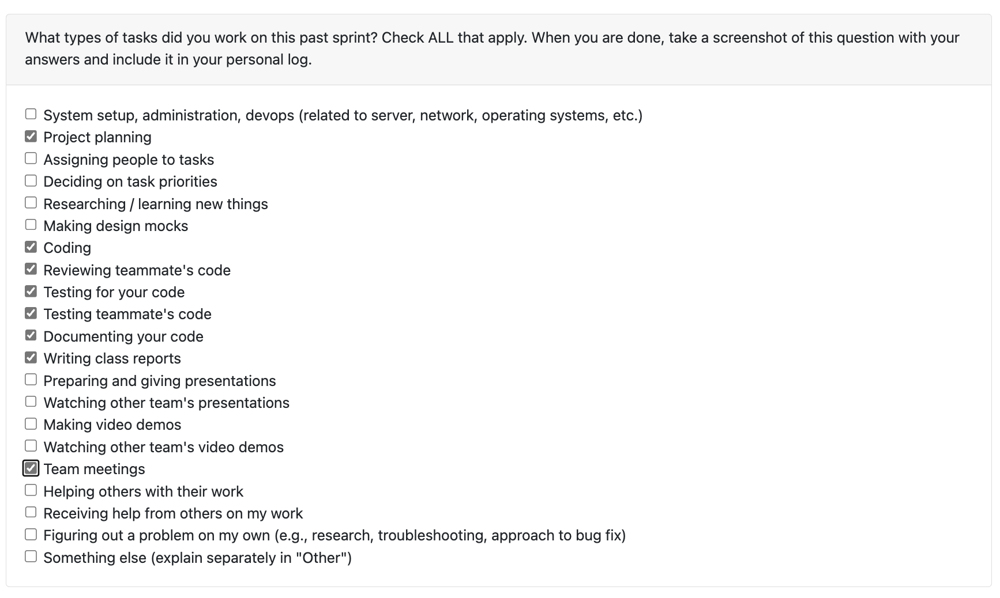
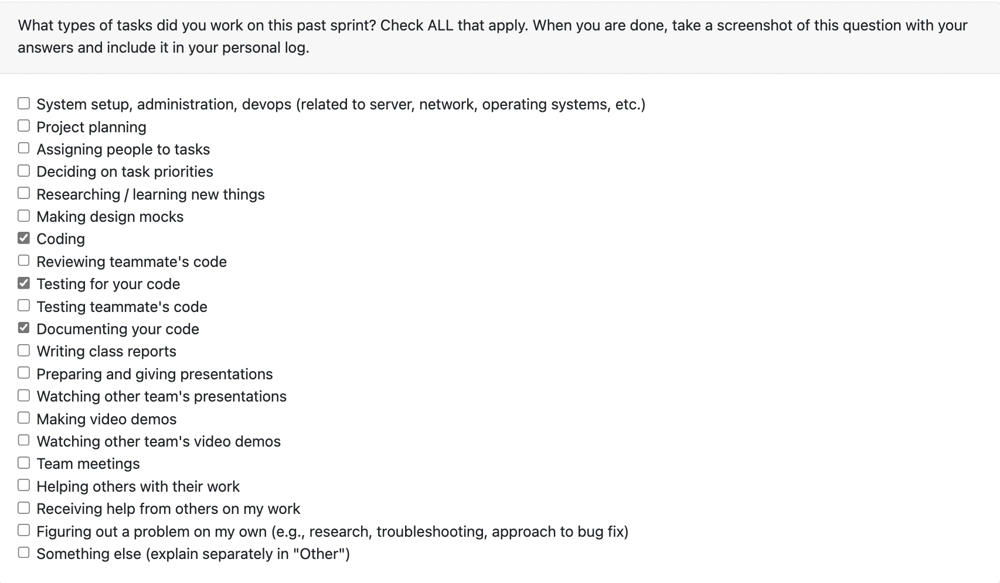

# Sam Sikora Personal Logs Term 2

## **[This Week](#week-2-0112---0118)**

## Table of Contents

- **[Week 3/4, 01/19 - 2/8](#week-34-0119---28)**
- **[Week 2, 01/12 - 01/18](#week-2-0112---0118)**
- **[Week 1, 01/05 - 01/11](#week-1-0105---0111--winter-break)**

---

## Week 3/4 01/19 - 2/8

### Coding Tasks

One PR this week focused on creating a portfolio class system that can support user edits, incremental additions, and a conflict managment system to handle when the two conflict. Another PR created an entirely new database system to support API development and ensure we don't have to rebuild the database schema every time. Lastly, I added a small PR to optimize our testing environment to quickly run without ML tests during development, but running the full suite on PR creation.

- [PR #383 Portfolio Class System](https://github.com/COSC-499-W2025/capstone-project-team-18/pull/383)
- [PR #412 New Database System](https://github.com/COSC-499-W2025/capstone-project-team-18/pull/412)
- [PR #397 Optimize Tests](https://github.com/COSC-499-W2025/capstone-project-team-18/pull/397)

### Testing Tasks

I wrote a comphersensive tests for both of my big PRs, and also restructed how tests are run in the PR mentioned above.

### Review Tasks

I reviewed the following PRs:

- [PR #411](https://github.com/COSC-499-W2025/capstone-project-team-18/pull/411)
- [PR #409](https://github.com/COSC-499-W2025/capstone-project-team-18/pull/409)
- [PR #401](https://github.com/COSC-499-W2025/capstone-project-team-18/pull/401)
- [PR #391](https://github.com/COSC-499-W2025/capstone-project-team-18/pull/391)
- [PR #388](https://github.com/COSC-499-W2025/capstone-project-team-18/pull/388)
- [PR #381](https://github.com/COSC-499-W2025/capstone-project-team-18/pull/381)
- [PR #411](https://github.com/COSC-499-W2025/capstone-project-team-18/pull/411)

### Summary

As talked about last week these weeks were focused on big architercure changes the portfolio system and an entire DB rework. Moving forward, look to start getting specific requirements for Milestone #2 done. I will do this by levelaging these new changes.

## Week 2 01/12 - 01/18

### Coding Tasks

This week my PR's from winter break that I mentioned last week were all reviewed and merged. See last week's log for details, but this includes:
- [PR #329 Logic for Serializing and Deserializing Statistic Values](https://github.com/COSC-499-W2025/capstone-project-team-18/pull/329)
- [PR #330 Capsulate Project and User Report Statistic Logic Analysis](https://github.com/COSC-499-W2025/capstone-project-team-18/pull/330)
- [PR #332 Refactor Test Directory](https://github.com/COSC-499-W2025/capstone-project-team-18/pull/332)
- [PR #333 Log Everything](https://github.com/COSC-499-W2025/capstone-project-team-18/pull/333)

Additionaly, I also adapted the logic of the project upload or start_miner function so that it was decoupled from the CLI, and thus could be run stateless from by an API in the future. ([#351](https://github.com/COSC-499-W2025/capstone-project-team-18/pull/351)).

I also configured and initialized the FastAPI service. This also included writing placeholder functions for all the endpoints required by Milestone #2 ([#355](https://github.com/COSC-499-W2025/capstone-project-team-18/pull/355)).

### Testing Tasks

I added tests to the API PR to make sure all Milestone #2 required endpoints existed and ran properly, and a very simple API ping to verify the service was running.

For the decoupling, I had to write some new unzip util functions so I added tests for all the new helper functions I wrote ([#351](https://github.com/COSC-499-W2025/capstone-project-team-18/pull/351)).

I also commited tests onto Jimi's bug fix PR to make sure that it we had a test for this bug and it doesn't happen again ([#358](https://github.com/COSC-499-W2025/capstone-project-team-18/pull/358)).

### Review Tasks

I reviewed Alex's PR [#356](https://github.com/COSC-499-W2025/capstone-project-team-18/pull/356) and Priyansh's PR [#364](https://github.com/COSC-499-W2025/capstone-project-team-18/pull/364)

### Summary

Last week was about getting huge refactors in to give us a clean slate. Now I am focusing on thinking about the big architercure changes that will allow us to best deliever on Milestone #2. I am the lead of the API team, so I will be focused on getting some endpoints delivered.

## Week 1 01/05 - 01/11 + Winter Break

I worked mainly on refactoring our code. I mostly focused on making and implementing consistent conventions and taking god classes and spliting the responsiblities into many different, refactorable code pieces. Specially, I split our report and analyzer code pieces into different files (#321), I added an empty file check before we analyzed files (#327), I created a one size fits all serializer and deserializer for the database (#329), I adapted the way we calcuated statistics to prevent shotgun changes when adding new statistics (#330), refactor the entire tests folder to split the tests up into logical subfolders and making sure the tests use the same, consistent helper functions (#332), and lastly I added support for logging through the system and added log messages (#333).
