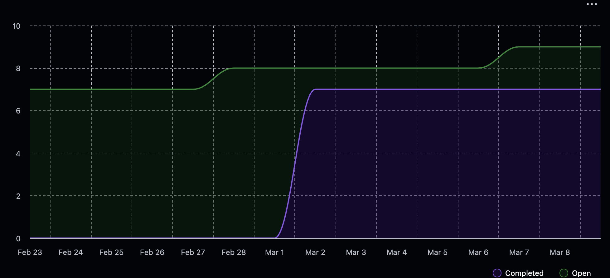

# Team 18 Term 2 — Week 8, Feb. 22 – Mar. 1

## Overview

### Milestone Goals

This week we focused on finishing up some lasting Milestone #2 requirements and a brand new unquie feature from Priyansh. The goals of this week were to give everyone some time to take a breath, fix things, and mock and think about designs for the front end for Milestone #3.

### Burnup Chart



## Details

### Username Mapping

```
jademola -> Jimi Ademola
eremozdemir -> Erem Ozdemir
thndlovu -> Tawana Ndlovu
alextaschuk -> Alex Taschuk
sjsikora -> Sam Sikora
priyansh1913 -> Priyansh Mathur
```

### Completed Tasks

- [#463 462 job readiness analysis feature](https://github.com/COSC-499-W2025/capstone-project-team-18/pull/463)
- [#460 Endpoints HotFix](https://github.com/COSC-499-W2025/capstone-project-team-18/pull/460)
- [#461 User Information Representation (Personalization)](https://github.com/COSC-499-W2025/capstone-project-team-18/pull/461)
- [#464 fix Checks for duplicate analysis were causing DB errors](https://github.com/COSC-499-W2025/capstone-project-team-18/pull/464)
- [#469 Upload Project Thumbnail Endpoint](https://github.com/COSC-499-W2025/capstone-project-team-18/pull/469)
