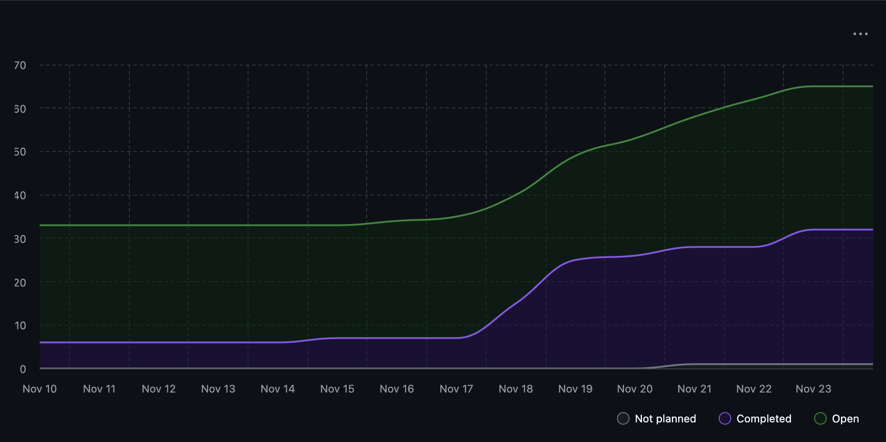

# Team 18 — Week 12, Nov. 17–23

## Overview

### Milestone Goals

This week, we focused on wrapping up final tasks and features, squashing bugs, and figuring out what is still left to be done before the due date for Milestone 1. This includes working on and/or completing the following features:
- 6. Store user configurations for future use
- 9. Extrapolate individual contributions for a given collaboration project
- 10. Extract key contribution metrics in a project, displaying information about the duration of the project and activity type contribution frequency (e.g., code vs test vs design vs document), and other important information
- 11. Output all the key information for a project
- 13. Retrieve previously generated portfolio information
- 14. Retrieve previously generated résumé item
- 15. Rank importance of each project based on user's contributions
- 16. Summarize the top ranked projects
- 17. Delete previously generated insights and ensure files that are shared across multiple reports do not get affected
- 18. Produce a chronological list of projects
- 19. Produce a chronological list of skills exercised

### Burnup Chart



## Details

### Username Mapping

```
jademola -> Jimi Ademola
eremozdemir -> Erem Ozdemir
thndlovu -> Tawana Ndlovu
alextaschuk -> Alex Taschuk
sjsikora -> Sam Sikora
priyansh1913 -> Priyansh Mathur
```

### Completed Tasks

The following issues were closed (the PR that closed the issue is in a comment on the issue)

**Database Management & Refactoring**
- [Issue #108: incorporate DB into app workflow](https://github.com/COSC-499-W2025/capstone-project-team-18/issues/108)
- [Issue #148: write reports to DB](https://github.com/COSC-499-W2025/capstone-project-team-18/issues/148)
- [Issue #158: store user preferences as JSON](https://github.com/COSC-499-W2025/capstone-project-team-18/issues/158)
- [Issue #212: store the name of the zipped folder in `user_report` table](https://github.com/COSC-499-W2025/capstone-project-team-18/issues/212)
- [Issue #215: db function to delete user report and relating data](https://github.com/COSC-499-W2025/capstone-project-team-18/issues/215)

**Project Discovery/Analysis**

- [Issue #173: Improve file path handling for cross-platform compatibility](https://github.com/COSC-499-W2025/capstone-project-team-18/issues/173)
- [Issue #187: Bug: If `_get_file_commit_percentage` can not be calcuatated, error is thrown](https://github.com/COSC-499-W2025/capstone-project-team-18/issues/187)
- [Issue #189: Bug: Reading a File causes the Date Created Metric to be Corruputed.](https://github.com/COSC-499-W2025/capstone-project-team-18/issues/189)
- [Issue #192: Generate more statistics for UserReport](https://github.com/COSC-499-W2025/capstone-project-team-18/issues/192)
- [Issue #200: Bug: `_analyze_git_authorship` incorrect pathing](https://github.com/COSC-499-W2025/capstone-project-team-18/issues/200)
- [Issue #202: Put `Repo` Object in the `Project` DataClass](https://github.com/COSC-499-W2025/capstone-project-team-18/issues/202)
- [Issue #204: In Git Repos, use Git Stats Instead of Metadata](https://github.com/COSC-499-W2025/capstone-project-team-18/issues/224)
- [Issue #205: Calculate Project Level Weighted Skills Statistic](https://github.com/COSC-499-W2025/capstone-project-team-18/issues/205)
- [Issue #217: Compile list of folders and files to ignore in `project_discovery.py`](https://github.com/COSC-499-W2025/capstone-project-team-18/pull/217)

**CLI**

- [Issue #193: Print Resume to the Terminal](https://github.com/COSC-499-W2025/capstone-project-team-18/issues/193)
- [Issue #196: Expand ResumeItem Bullet Points Based on Real Statistics](https://github.com/COSC-499-W2025/capstone-project-team-18/issues/196)

**`main` Branch**

Additionally, we merged a working version of the app to the [`main`](https://github.com/COSC-499-W2025/capstone-project-team-18/tree/main) branch for the demo on Nov, 19.

### In Progress Tasks

- [Issue #208: Ignore `git` functions if user does does not provide email](https://github.com/COSC-499-W2025/capstone-project-team-18/issues/208)
- [Issue #211: Function(s) to retrieve data from the database.](https://github.com/COSC-499-W2025/capstone-project-team-18/issues/211)
- [Issue #214: Delete previously generated insights without modifying irrelevant data](https://github.com/COSC-499-W2025/capstone-project-team-18/issues/214)
- [Issue #225: In Git Repos, Ignore a File a User Has Never Touched](https://github.com/COSC-499-W2025/capstone-project-team-18/issues/225)

### Test Report

