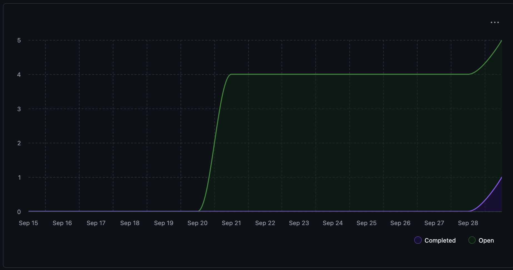

# Team 18 — Week 4, Sept. 22-28

## Overview

### Milestone Goals

This week the goals were to complete the system architecture diagram, project proposal and flesh out the tech stack we plan to implement. This included defining use cases, test cases, functional and no-functional requirements as well as project scope. The tech stack has now been defined as a Electron framework which uses the React library for the frontend, a Node.js backend and Jest for our testing framework.

### Burnup Chart



## Details

### Username Mapping

```
jademola -> Jimi Ademola
eremozdemir -> Erem Ozdemir
thndlovu -> Tawana Ndlovu
alextaschuk -> Alex Taschuk
sjsikora -> Sam Sikora
priyansh1913 -> Priyansh Mathur
```

### Completed / In-Progress Tasks

Given the current progress on the project there is no tabular view available for complete or in-progress tasks as of yet.

### Test Reports

Similarly to above, given no code has been developed yet, there are subsequently no tests to be reported on.
