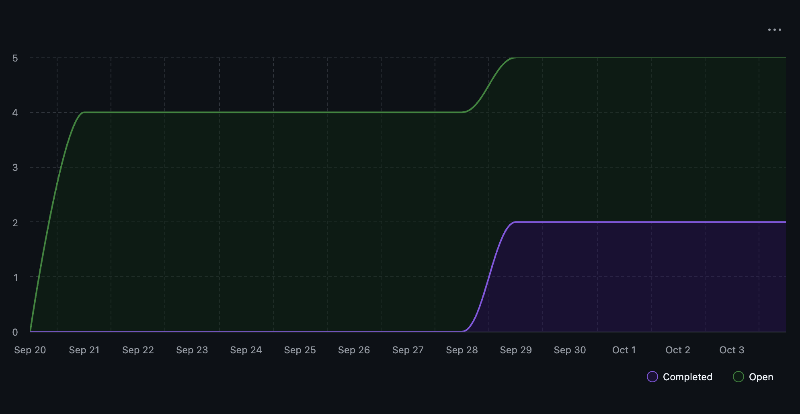

# Team 18 — Week 5, Sept. 29 – Oct. 05

## Overview

### Milestone Goals

This week's goals were to complete the DFDs and continue fleshing out specific implementation techniques that we plan to use in the coming weeks.

### Burnup Chart



## Details

### Username Mapping

```
jademola -> Jimi Ademola
eremozdemir -> Erem Ozdemir
thndlovu -> Tawana Ndlovu
alextaschuk -> Alex Taschuk
sjsikora -> Sam Sikora
priyansh1913 -> Priyansh Mathur
```

### Completed Tasks / In Progress Tasks

Given the current progress on the project there is no tabular view available for complete or in-progress tasks as of yet.

### Test Report
Similarly to above, given no code has been developed yet, there are subsequently no tests to be reported on.

### (Optional) Additional Info

The team completed a level 0 and a level 1 DFD this week