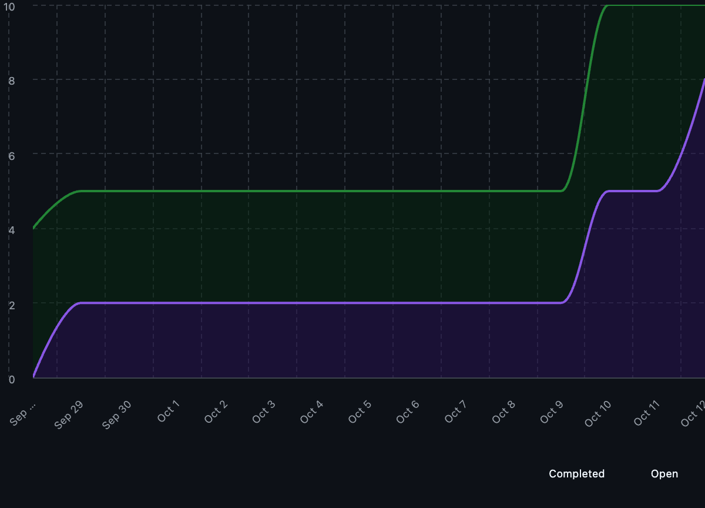

# Team 18 — Week 6, Oct. 06–12

## Overview

### Milestone Goals

This week the goal was to restructure our project with the finalized Milestone #1 requirements, which introduced Python as the required implementation language and shifted our focus to a command-line-only implementation. We revised the system architecture accordingly, updated the Level 0 and Level 1 DFDs to reflect the removal of the dashboard and web components, and clarified data storage through a centralized database. The README was updated with links and explanations for the revised architecture, diagrams, and WBS, and we also prepared our development environment by reviewing Docker basics.

### Burnup Chart



## Details

### Username Mapping

```
jademola -> Jimi Ademola
eremozdemir -> Erem Ozdemir
thndlovu -> Tawan Ndlovu
alextaschuk -> Alex Taschuk
sjsikora -> Sam Sikora
priyansh1913 -> Priyansh Mathur
```

### Completed Tasks/In Progress Tasks

Given the current progress on the project there is no tabular view available for complete or in-progress tasks as of yet.

### Test Report
Given that no code has been developed yet, there are subsequently no tests to be reported on.

### (Optional) Additional Info

We completed the following documentation updates to align with the revised architecture and week 6 requirements:

1. Updated the README with a link and explanation for the final system architecture diagram
2. Updated the README with a link and explanation for the revised Level 0 and 1 DFD's
3. Updated the README with a link and explanation for the updated WBS

These updates are now reflected in the documentation branch.