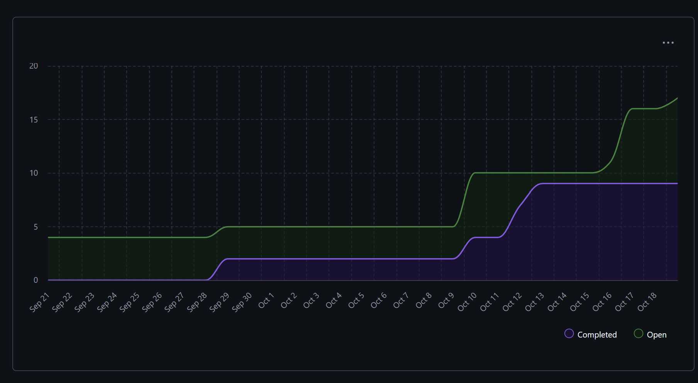

# Team 18 — Week 7, Oct. 13–19

## Overview

### Milestone Goals

This week we transitioned from planning to active development. The primary goal was to initialize the core class structure for our statistics system and begin implementing foundational features for the command-line interface. We successfully merged our first code implementation (Analyzer, Report, and Statistics classes) and created comprehensive documentation to guide future development. Development tasks were organized through 7 new issues to enable parallel work across the team.

### Burnup Chart



## Details

### Username Mapping

```
jademola -> Jimi Ademola
eremozdemir -> Erem Ozdemir
thndlovu -> Tawan Ndlovu
alextaschuk -> Alex Taschuk
sjsikora -> Sam Sikora
priyansh1913 -> Priyansh Mathur
```

### Completed Tasks

This week the team successfully merged the following pull requests:

**PR #27** - Initialized Classes: Analyzer, Report, and Statistics (merged Oct 13). This PR established the core class structure for the statistics system by creating BaseFileAnalyzer, TextFileAnalyzer, FileReport, ProjectReport, and UserReport classes. We implemented StatisticTemplate, StatCollection, and StatisticIndex classes that form the foundation of our data tracking system. Initial test coverage was added with 15 passing tests for StatisticIndex, ensuring the reliability of these core components.

**PR #44** - This PR added a comprehensive 100-line README that explains the entire class architecture and how Statistics, Reports, and Analyzers work together. We included practical code examples showing usage patterns to help team members understand how to use the system. Additionally, we created a standardized PR template for future contributions and improved docstrings and comments throughout the codebase to enhance code readability..

**PR #35** - This PR merged all Week 6 development work from the develop branch into the main branch.

**PR #46** - Clean Up Statistic Index Class (created Oct 18, pending merge). This PR focuses on refactoring the StatisticIndex class to improve code quality and maintainability. The changes have been reviewed and approved by the team.

**Closed Issues:**

We successfully closed two issues this week. Issue #23 involved updating the repository README to reflect our current project structure and workflow, which was completed on October 13. Issue #26 focused on creating the Work Breakdown Structure (WBS) for work allocation across the team, ensuring clear task distribution and accountability.

### In Progress Tasks


**Active Issues:**

The team created seven new development issues this week to organize parallel work streams. Issue #38 addresses the need for a "cancel" command in the CLI to improve user experience. Issue #39 focuses on implementing logic to determine the user's operating system for cross-platform compatibility. Issue #40 involves creating a global file parser to handle different file types. Issue #41 is dedicated to developing comprehensive test cases for the CLI functionality. Issue #42 aims to automatically freeze pip packages on commit to ensure consistent dependencies. Issue #43 was created to enhance documentation for the class structure and was successfully completed through PR #44. Issue #45 focuses on cleaning up the StatisticIndex class implementation.

### Test Report

With the initialization of core classes, we now have the first test suite in place. All 15 test cases for the StatisticIndex class are passing (100% success rate), covering statistic creation and type validation, collection operations, export functionality, and File/Project/User level statistics. This test coverage ensures the reliability of our core data structures.

### Additional Info

**Next Steps for Week 8:**

Looking ahead to next week, we plan to complete CLI test coverage as outlined in Issue #41, implement the file parser functionality described in Issue #40, and add OS detection logic per Issue #39. We will also implement the "cancel" command for the CLI (Issue #38), merge the StatisticIndex cleanup PR (#46), and continue building out additional analyzer implementations to expand the system's capabilities.
