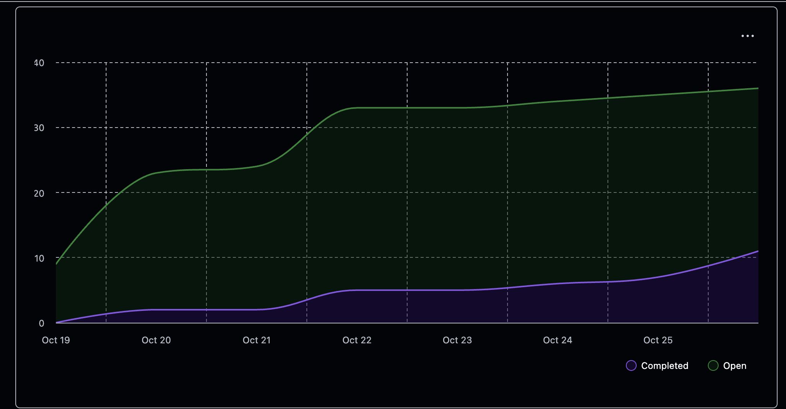

# Team 18 — Week 8, Oct 19-26

## Overview

### Milestone Goals

This week we focused on coding up an end to end workflow. We created issues and worked on things that would help develop our system to get from filepath to information on the terminal. This inculded project discovery, project and file analyzers, database setup, and statistic reporting.

Specifcally, we worked on the following Milestone #1 requirements with the followings tasks:
- Parse a specified zipped folder containing nested folders and files.
    - Inital logic for this was completed with #67.
- Distinguish individual projects from collaborative projects.
    - Logic for this was completed with #67.
- For a coding project, identify the programming language and framework used.
    - Programming language specific logic was created with #90 and #88
- Extract key contribution metrics in a project, displaying information about the duration of the project and activity type contribution frequency (e.g., code vs test vs design vs document), and other important information.
    - This was worked on with tasks #90, #88, #69
- Output all the key information for a project
    - This was worked on with task #91
- Store project information into a database
    - Inital database setup was created with #96

### Burnup Chart



## Details

### Username Mapping

```
jademola -> Jimi Ademola
eremozdemir -> Erem Ozdemir
thndlovu -> Tawana Ndlovu
alextaschuk -> Alex Taschuk
sjsikora -> Sam Sikora
priyansh1913 -> Priyansh Mathur
```

### Completed Tasks

| Issue Title    | ID | Username |
| -------- | ------- |----|
| Create a Family of TextBased Analyzers  | #88    | sjsikora|
| Add Automatic Testing on PR Create | #85   |sjsikora|
| From Zip File Path Discover Simple Projects | #67   |priyansh1913 |
| add_list doesn't exist in StatisticIndex anymore but is still being called | #82   |alextaschuk |
| Display a Friendly Representation of UserReport Class | #71   |thndlovu |
| Create File Reports for each Project | #68  |jademola  |
|  back/cancel bug fix| #74  |eremozdemir |
| create more coding specific analyzers| #90   |priyansh1913 |
| user database config | #80   | alextaschuk |
| Added project start and end statistics | #69   |eremozdemir |


### In Progress Tasks

No in progress.


### Test Report


