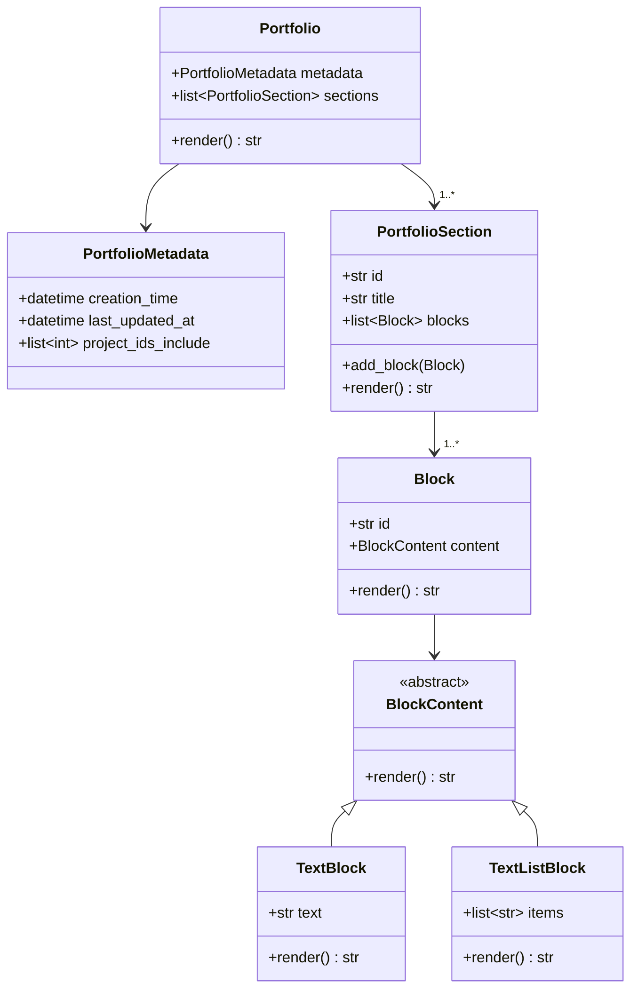
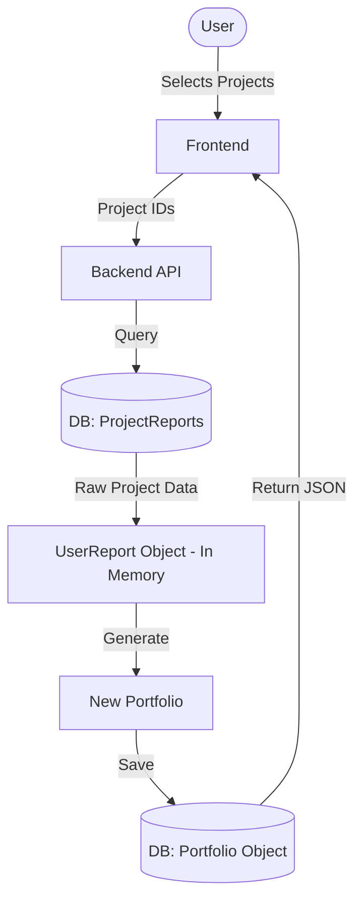
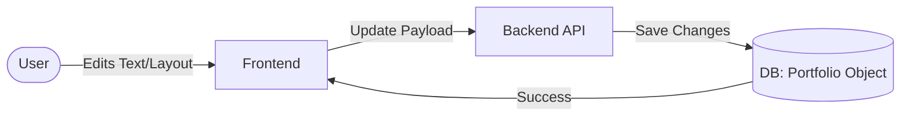
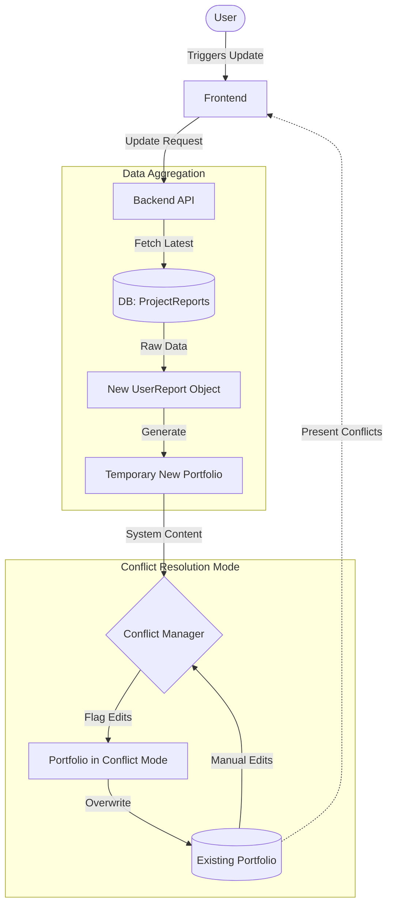

# Portfolio Class System

## Overview

The portfolio object has evolved from just a string representation of a UserReport. Now, we have features to handle incremental, user, additions, updating a portfolio with recent project changes, and conflict resolution.

Roughly, a portfolio is made up of metadata, and an ordered list of sections. Everyone of these sections has an ordered list of Blocks, which have some sort of content inside.

## Classes in Play

### Portfolio

The defacto class to hold everything about a portfolio. A user may have many different portfolios. A portfolio is made up of a ordered list of portofolio sections.

### Portfolio Metadata

Metadata about the portfolio, useful for seeing information like date created for the portfolio.

### PortfolioSection

A section is a logical group of content in a portfolio. The simpliest is example is that you can think of an "Important Date" sections
that each have a block content of "Date of first project", "Date ended". The portofolio section is made up of an ordered list of blocks.

### Block

The class that actually stores text, images, or list. It is the actual content of the portfolio.

### BlockContent

An abstarct interface that defines what lives in a block. It has the logic for updatig

## Key Use Cases

Now lets go over a couple different use cases we have for this portfolio.

### Creating a new Portfolio

So, to recap, ProjectReports in the database will always be up to date with the most current information. When the user requests a Portfolio, they pass in what projects they want to include. We then retrieve those projects from the database, make a UserReport, and then use the UserReport to make a Portfolio, which is then returned to the user.

### User Alterations

With the new required changes in M2, a user may modify the Portfolio text themselves. We do this on a block by block basis. Every block has its own JSON schema to update the block.

### Incremental Additions / Conflict Resolution

Also new in M2 is that a user needs to update their Portfolio with a new project or update the original projects used to first generate the portfolio. So, to update a portfolio, we need to retrieve the projects from the database, create a **new UserReport** object, which is used to create a **new portfolio**, and that new portfolio is then merged with the user's portfolio.

The crux of the portfolio is that we may have a situation where the user edits a portfolio, and then they add on to the portfolio with another project. In this, the user and the system have divergent changes. The block will then go into conflict mode. In this mode, the user is presented with the conflicts on the frontend and they must 1. either accept the system changes or 2. update the user content.

