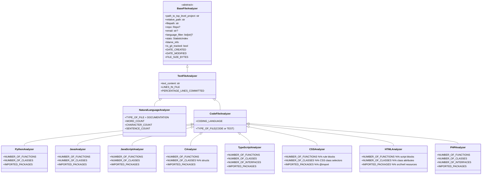

# Overview

## Summary

The purpose of an analyzer class is to measure everything we can about a file. Although, there are different levels to this depending on a file type. We will get different information and we will retieve it differently if a file is a pdf or a python file. So, we define a family of many different analyzers and for every file, we try to give it to the most accurate analyzer.

The BaseFileAnalyzer is the basis for all these, we will always always know the size of a file in bytes, the created date, modified date, but that is all we know for a file.

Now, what if the file is text based? (.txt, .py, .md, etc) Then, we can create a TextFileAnalyzer that can make text based statistics (number of lines, words written, characters type, etc).

Now, what if that file is a python file? Well can get even more information about the file. Look for the import keyword in the file, are they importing a package often? Say, pandas? That probably means that they are skilled in that package and should make a statistic about that skill.

We keep building these analyzers out, image based analyzers, .R, .csv, .java, etc. At every specific analyzer class, we are creating as many statistics as possible with the given knowledge of it being a file, or text based, or python etc.

## Class Diagram

